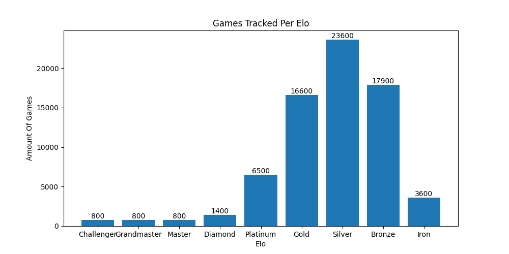
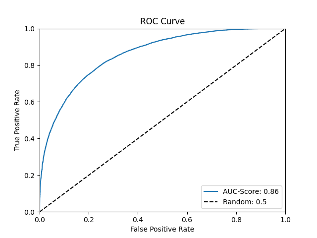
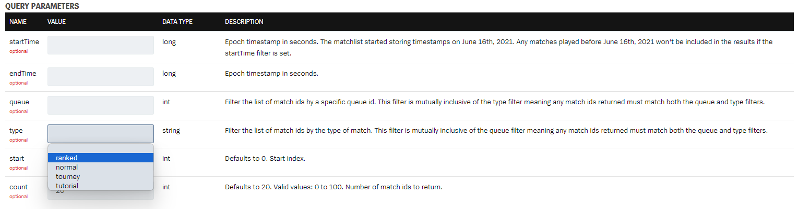
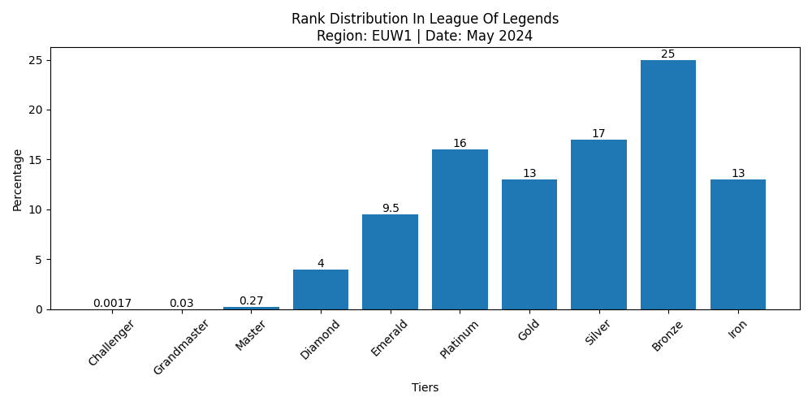
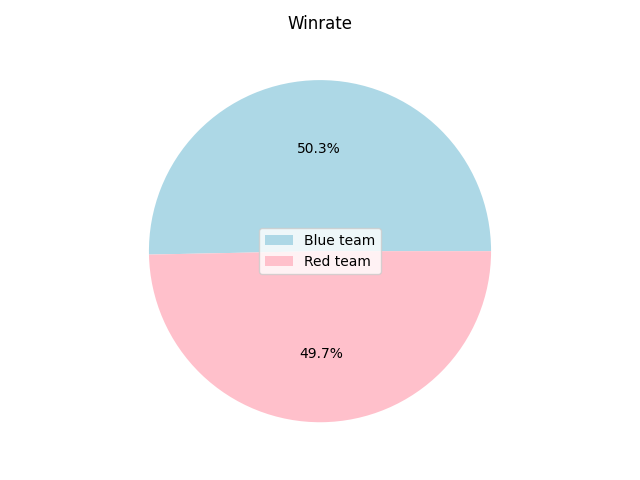
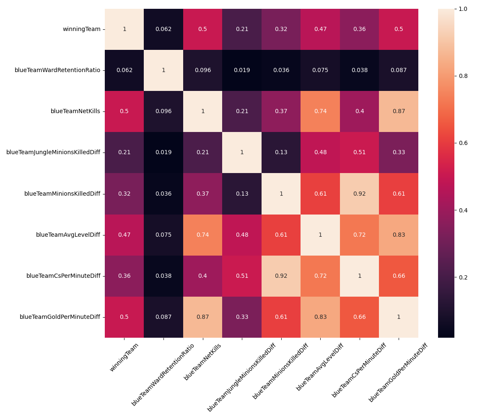
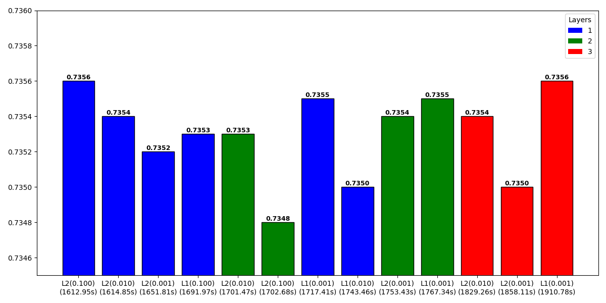
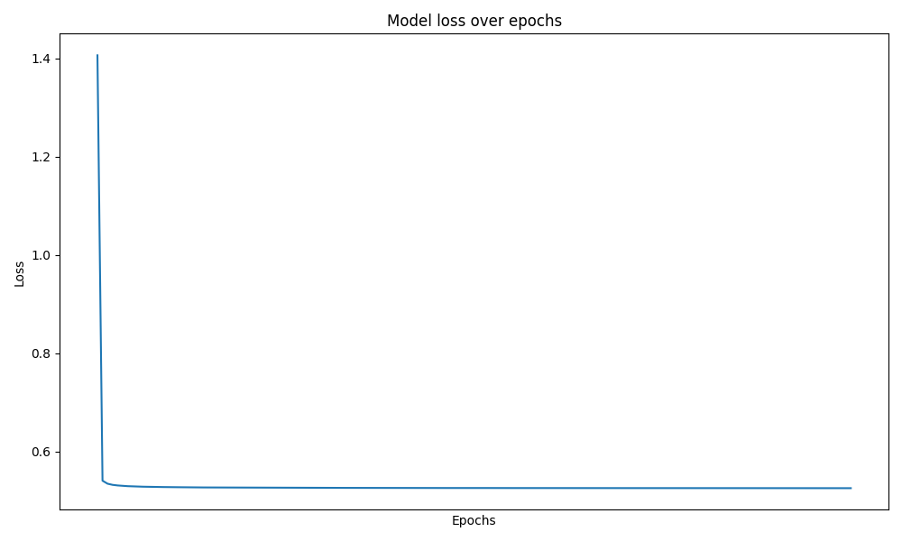

3 a.m. productions presents:

# Data Science Project On League Of Legends

## Table of Content

- [Disclaimer](#disclaimer)
- [Project Object](#project-object)
- [Acquiring Data](#acquiring-data)
- [The Match Data](#the-match-data)
- [The Actual Match Data I Was Able To Acquire](#the-actual-match-data-i-was-able-to-acquire)
- [Why My Data Could Be Biased](#why-my-data-could-be-biased)
- [Data Cleaning](#data-cleaning)
- [Exploratory Data Analysis](#exploratory-data-analysis)
- [Feature Engineering](#feature-engineering)
- [Dealing With Multicollinearity](#dealing-with-multicollinearity)
- [Building The Model](#building-the-model)
- [Evaluation](#evaluation)
- [Review](#review)

# Revamping The Project With Different Data

## Table of Content

- [Re Disclaimer](#re-disclaimer)
- [Re Project Object](#re-project-object)
- [Re Data I Will Use This Time](#re-data-i-will-use-this-time)
- [Re Data Cleaning](#re-data-cleaning)
- [Re Exploratory Data Analysis](#re-exploratory-data-analysis)
- [Re Feature Engineering](#re-feature-engineering)
- [Re Building The Model](#re-building-the-model)
- [Re Evaluation](#re-evaluation)
- [Re Review](#re-review)

# Third iteration: Think a title yourself

## Table of Content

- [Re Re Disclaimer](#re-re-disclaimer) (Just kidding, I won't just add another `Re` everytime lol)
- [Project Object the Third](#project-object-the-third) (Does that sound better? I am not sure..)
- [3 Data Used](#3-data-used) (Might aswell keep it simple)
- [Data Cleaning 3](#data-cleaning-3) (Or should I put the number behind the chapter name?)
- [Exploratory Data Analysis 3](#exploratory-data-analysis-3) (It's boring to just add a number, isn't it?)
- [Feature Engineering THREE](#feature-engineering-three) (No, that sounds aggressive for some reason)
- [Building The Model III](#building-the-model-iii) (I like that, though)
- [Evaluation IV](#evaluation-iv) (Oh, that's the end of the ToC already)
- [Famous Last Words](#famous-last-words)

## Disclaimer

This project was a uni assignment.

All information given are up-to-date as of June 2022.

Feel free to use this project as a guide or for your own assignment in case you are too 'busy'.

Please note, I wrote this README *while* working on this project, which is why I might miss some preliminary considerations for later chapters.

Only 1 animal (me) was harmed during the realisation of this project.

In case you wish to contact me for whatever reason, please use discord and find me by my tag (letmecook7).

## Project Object

Main target for this project will be able to predict the outcome of a game based on in-game values at the 15-minute mark.

## Acquiring Data

I have two options on acquiring my data to use.


Using pre-made data surely saves a lot of time. Unfortunately League Of Legends changes a lot within a short amount of time.
Hence, pre-made data might not be up-to-date which is why I will use my own data.
Luckily, [Riot Games](https://developer.riotgames.com/apis) offers an API with lots of different endpoints I can use and even a [documentation](https://riot-api-libraries.readthedocs.io/en/latest/collectingdata.html) on collecting data.

The actual game data for a game can be read via Riot Game's '[Match-V5](https://developer.riotgames.com/apis#match-v5)' (specifically, /lol/match/v5/matches/{matchId}) endpoint.
Since I am trying to read the data of a game at the 15-minute mark, I will have to use the '/lol/match/v5/matches/{matchId}/timeline'-endpoint.
Both require the corresponding game id as input.

The game id can be acquired by reading a player's match history.
I can do that by using the same endpoint (Match-V5, specifically '/lol/match/v5/matches/by-puuid/{puuid}/ids') as mentioned before.
This does require a player's PUUID (Player Universally Unique Identifiers) which is, according to an [article](https://www.riotgames.com/en/DevRel/player-universally-unique-identifiers-and-a-new-security-layer) posted on [riotgames.com](https://www.riotgames.com/en), a unique and consistent identifier across regions, nations and games.

Now, the last step (actually the first, since I for some reason started this list the other way around..) is getting a player's PUUID.
I can get that by using the '[Summoner-V4](https://developer.riotgames.com/apis#summoner-v4)' (specifically, /lol/summoner/v4/summoners/by-name/{summonerName}) by entering a player's summoner name and their region.

    Sidenote:
    There are different regions players can play on, such a north american, europe west or asia.
    The summoner name represents the player's nickname which will be displayed in the game.

Great. Now that I know how to get the data I can get it. Or do I?

Unfortunately, Riot Games limited the API access rates to:

- 20 requests every 1 seconds(s)
- 100 requests every 2 minutes(s)

Since I am aiming for a data set including up to 100k (one-hundred thousand) matches, I would have my script running for 33,3 hours.
Sadly, Riot Games API keys are only valid for 24 hours.
Hence, I will have to reduce my data to around 72k (seventy-two thousand) entries (you can do the math by yourself, who am I to note down literally everything is this README).

The next issues will be getting the correct amount of PUUIDs and an even distribution of the player's elo.

    Sidenote:
    A player's 'elo' determines a player's skill.
    Has a player a higher elo than average they are better than the average League Of Legends player.

Since I want my solution to be able to predict the outcome of the *majority* of the games, I will my need data to represent the rank distribution.

Surely I could only use data from the average League of Legends player, but where's the fun in that?

League of Legends rank distribution (according to [League of Graphs](https://www.leagueofgraphs.com/rankings/rank-distribution) as of June 2022) is as follows:


That means my data *should* consist of the following amount of games per elo:

| Rank | Challenger | Grandmaster | Master | Diamond | Platinum | Gold | Silver | Bronze | Iron | **Total** |
|------|------------|-------------|--------|---------|----------|------|--------|--------|------|-----------|
| %    | 1          | 1           | 1      | 2       | 9        | 23   | 33     | 25     | 5    | **100**   |

Note that this is not perfect rounding, but now I can use data from Challenger, Grandmaster and Master player aswell.

If I used the same amount of games for e.g. 1 Challenger player and 33 Silver player for the entire list, I would end up with 720 matches per player.
That is a huge number considering Riot Game's miserable transparency for player's match history.
In order to reduce that number, I will have to increase the amount of player I am querying relative to their percentage as seen in the table above.

That results in:

| Rank            | Challenger | Grandmaster | Master | Diamond | Platinum | Gold   | Silver | Bronze | Iron  |
|-----------------|------------|-------------|--------|---------|----------|--------|--------|--------|-------|
| Players Tracked | 4          | 4           | 4      | 8       | 36       | 92     | 132    | 100    | 20    |
| Games Tracked   | 720        | 720         | 720    | 1.440   | 6.480    | 16.560 | 23.760 | 18.000 | 3.600 |

and reducing the original 720 matches per player down to 180.

That is a lot of player to query.. Unfortunately Riot Game's match history endpoint got a maximum of 100 matches per player.
Thats means I have to reduce the matches per player even more and increase the number of player to query.. yay.

That results in:

| Rank            | Challenger | Grandmaster | Master | Diamond | Platinum | Gold   | Silver | Bronze | Iron  | **Total**  |
|-----------------|------------|-------------|--------|---------|----------|--------|--------|--------|-------|------------|
| Players Tracked | 8          | 8           | 8      | 14      | 65       | 166    | 238    | 180    | 36    | **723**    |
| Games Tracked   | 800        | 800         | 800    | 1.400   | 6.500    | 16.600 | 23.800 | 18.000 | 3.600 | **72.300** |

This surpasses the 72k (seventy-two thousand) matches, but I can fix that by reducing the amount of silver player tracked by 2 and the amount of bronze player tracked by 1.

Resulting in:

| Rank            | Challenger | Grandmaster | Master | Diamond | Platinum | Gold   | Silver | Bronze | Iron  | **Total**  |
|-----------------|------------|-------------|--------|---------|----------|--------|--------|--------|-------|------------|
| Players Tracked | 8          | 8           | 8      | 14      | 65       | 166    | 236    | 179    | 36    | **720**    |
| Games Tracked   | 800        | 800         | 800    | 1.400   | 6.500    | 16.600 | 23.600 | 17.900 | 3.600 | **72.000** |

(Don't worry, that's the last table for this section)

Here is the final graph which surely is not 100 % in compliance with the rank distribution as seen in the picture above, but it is the closest I can get:



Since I cannot divide 8 player by 11 different regions, and I can only test it on my own region, I will only use data from EU West (EUW1).

The very last issue to handle is getting such an amount of player. Remember, each has to have at least 100 ranked games played.
I could grab myself a few player, iterate over their matches played and read the other 9 player in their game and iterate over their games aswell.
That sounds like a nice way to do. Sadly I cannot ensure that every player has more than 100 ranked games played when doing it this way.
Therefore, I will grab all player by hand. Yes, all 720.  
(I will do this later, though!)

    Sidenote:
    There are different game modes player can play in League of Legends.
    I will focus on ranked games.
    That will reduce the number of unconventionally playstyles and ensures healthy stats as people tend to play more serious.

In case one is too lazy to gather all the summoner names by hand, Riot Games offers the [LEAGUE-V4-endpoint](https://developer.riotgames.com/apis#league-v4) to get various player by elo.
The script for this could look like this:

    import requests
    
    with open('summoner-names.txt', 'a') as f:
        response = requests.get(
            'https://euw1.api.riotgames.com/lol/league/v4/entries/RANKED_SOLO_5x5/SILVER/III?page=5&api_key=YOUR-RIOT-GAMES-API-KEY')
        res = response.json()
        for x in range(300):
            try:
                f.write(res[x]['summonerName'] + '\n')
            except:
                pass

***To summarise:***

- I will use my own data
- I will get the data with Riot Game's API using different endpoints
- If my calculations are correct, I will end up with around 72000 match entries in my data set
- I will use a different amount of player per elo according to the rank distribution
- I will use 100 games per player out of 720 player
- I will gather all the player/summoner names to track by myself

Great. I need a coffee after that section..

## The Match Data

This section should be added up the prior one as it is part of acquiring data, but I decided to split them since this section is more about designing the data frame out of the Riot Game's API and less mathematically.

The average game duration of the region EUW (including the games being surrendered) for all tiers is 28,8 minutes repetend (according to [League of Graphs](https://www.leagueofgraphs.com/de/rankings/game-durations/euw) as of June 2022).

When querying a match with a timeline with the average game duration, the returning JSON file includes about 35k (thirty-five thousand) lines which would be too much to display for this README.
Therefore, I will display a simplified 'pseudo'-version of it for you to be able to follow up:

    metadata
        match id
        participants
    info
        event
            event type
            timestamp
            additional event info
        stats
            player 1
            player 2
            ...
            player 10
            timestamp
        event
            event type
            timestamp
            additional event info
        stats
            player 1
            player 2
            ...
            player 10
            timestamp
        ...

Note that there will be new 'event' and 'stats' entries every minute. That means, including the 0th minute, there will be 1 + 28 'event'/'stats' entries in a match with a duration of 28 minutes.

I will focus on only the 'stats' at the 15-minute timestamp since that includes the values I want.

The timestamps are in milliseconds and sadly there is not always the same timestamp at the 15-minute mark.
Here are some examples of the 15-minute timestamp of a couple of games:

| Game ID      | EUW1_5918185545 | EUW1_5852386422 | EUW1_5847243069 |
|--------------|-----------------|-----------------|-----------------|
| Milliseconds | 900207          | 900231          | 900276          |
| Minutes      | 15.00345        | 15.00385        | 15.0046         |

That means I will have to query for a range of integers.
Since I cannot look at a decent amount of games to be able to confidently define the average of the 15-minute timestamp, I will use 900000-901000 milliseconds (or 15-15,0166667 minutes).

Here is an example the 'stats' of one player at a certain timestamp:

    "1": {
        "championStats": {
            "abilityHaste": 0,
            "abilityPower": 0,
            "armor": 42,
            "armorPen": 0,
            "armorPenPercent": 0,
            "attackDamage": 73,
            "attackSpeed": 127,
            "bonusArmorPenPercent": 0,
            "bonusMagicPenPercent": 0,
            "ccReduction": 5,
            "cooldownReduction": 0,
            "health": 685,
            "healthMax": 685,
            "healthRegen": 17,
            "lifesteal": 0,
            "magicPen": 0,
            "magicPenPercent": 0,
            "magicResist": 32,
            "movementSpeed": 350,
            "omnivamp": 0,
            "physicalVamp": 0,
            "power": 339,
            "powerMax": 339,
            "powerRegen": 15,
            "spellVamp": 0
        },
        "currentGold": 98,
        "damageStats": {
            "magicDamageDone": 0,
            "magicDamageDoneToChampions": 0,
            "magicDamageTaken": 0,
            "physicalDamageDone": 440,
            "physicalDamageDoneToChampions": 0,
            "physicalDamageTaken": 0,
            "totalDamageDone": 440,
            "totalDamageDoneToChampions": 0,
            "totalDamageTaken": 0,
            "trueDamageDone": 0,
            "trueDamageDoneToChampions": 0,
            "trueDamageTaken": 0
        },
        "goldPerSecond": 0,
        "jungleMinionsKilled": 0,
        "level": 1,
        "minionsKilled": 4,
        "participantId": 1,
        "position": {
            "x": 2206,
            "y": 12847
        },
        "timeEnemySpentControlled": 0,
        "totalGold": 598,
        "xp": 211
    }

and a list of data I want to gather:

| **Value**                | **Explanation**                                                                    | **Where/How to get**                                                                        |
|--------------------------|------------------------------------------------------------------------------------|---------------------------------------------------------------------------------------------|
| win                      | Which team did win                                                                 | 'GAME_END'-event                                                                            |
| wardsPlaced              | A ward provides vision and might prevent death                                     | Iterate over each 'WARD_PLACED'-event and add up                                            |
| wardsDestroyed           |                                                                                    | Iterate over each 'WARD_KILL'-event and add up                                              |
| firstBlood               | The first kill in a game provides extra gold                                       | 'killType': 'KILL_FIRST_BLOOD'                                                              |
| kills                    | Provides gold and experience and prevents enemy from gathering gold and experience | Iterate over each 'type': 'CHAMPION_KILL' and add for each 'killerID'                       |
| deaths                   |                                                                                    | Iterate over each 'type': 'CHAMPION_KILL' and add for each 'victimID'                       |
| assists                  | Provides a tiny bit of gold and experience                                         | Iterate over each 'type': 'CHAMPION_KILL' and add 'assistingParticipantIds' for each player |
| dragons                  | Provides team-wide buff, gold and experience                                       | Iterate over each 'mosterType': 'DRAGON' and read 'killerTeamId'                            |
| heralds                  | Once killed, a herald can be placed to destroy buildings                           | Iterade over each 'monsterType': 'RIFTHERALD' and read 'killerTeamId'                       |
| towerDestroyed           | Provides gold, opens the map                                                       | Iterate over each 'type': 'BUILDING_KILL' where 'buildingType': 'TOWER_BUILDING'            |
| totalGold                | Gold is required to purchase items                                                 | Read 'totalGold' from 'stats' per player                                                    |
| avgLevel                 | Player get better stats when advancing to the next level                           | Read 'level' for each summoner and divide by 5                                              |
| totalMinionsKilled       | Minions provide gold and experience                                                | Read 'minionsKilled' and add up for each player                                             |
| totalJungleMonsterKilled | Jungle monster provide gold and experience                                         | Read 'jungleMinionsKilled' and add up for each player                                       |
| csPerMinute              | Amount of minions killed per minute                                                | Add totalMinionsKilled for each player, divide by 5, divide by 15                           |
| goldPerMinute            | Amount of gold acquired per minute                                                 | Read 'goldPerSecond' for each player, add up and divide by 5                                |
| gameDuration             |                                                                                    | 'GAME_END'-event                                                                            |

(Sorry for that huge table!)

Please note that the explanation and how-to-get column might be a bit 'thin', explanation-wise.
That is to not overload the table.
Also, iterating and adding up means to add up for each player of *one* team.
(More explanation might follow)

The table below shows my variables and their data types:

| **Variable**                     | **Datatype** |
|----------------------------------|--------------|
| blueTeamWin                      | integer      |
| blueTeamWardsPlaced              | float        |
| blueTeamWardsDestroyed           | float        |
| blueTeamFirstBlood               | integer      |
| blueTeamKills                    | integer      |
| blueTeamDeaths                   | integer      |
| blueTeamAssists                  | integer      |
| blueTeamDragons                  | integer      |
| blueTeamHeralds                  | integer      |
| blueTeamTowerDestroyed           | integer      |
| blueTeamTotalGold                | integer      |
| blueTeamAvgLevel                 | float        |
| blueTeamTotalMinionsKilled       | integer      |
| blueTeamTotalJungleMonsterKilled | integer      |
| blueTeamCsPerMinute              | float        |
| blueTeamGoldPerMinute            | float        |
| gameDuration (in seconds)        | integer      |

Please note, there will be the same variables for the red team aswell.

    Sidenote:
    blueWin (and redWin) will be a numeric value to simplify the handling in the dataframe later

The participant's ids (which are not shown in the sample above) are sorted so that the first 5 ids are player from the blue team, while the last 5 ids are from the red team.
That is required to know since the events I will iterate over are assigned to these participant ids.
Also, the 'winningTeam'-variable is an integer, either set to 100 if the blue team won, or 200 if the red team won.
This is required to determine which team won the game, obviously.

Performance-wise I will filter all the necessary values and store them a csv file for each API call.

## The Actual Match Data I Was Able To Acquire

Unlike the prior section, where I covered the theoretical way to get the data, this chapter is about the issues I faced when *practically* getting the data.

I made some smaller mistakes in the script which lead my data to be incorrect.
These include not resetting variables which resulted in things like 300 towers destroyed in a single game (which is not impossible but highly unlikeable).

A major issue was probably with the Riot Games API (probably because I don't know exactly what produces the issue).
When querying for a match, eventually the script threw a KeyError exception (as if the JSON file being returned by the API does not contain a specific key in the JSON-dictionary).

After some code-tweaking I ended up on a script I was able to run for hours, here is a simplified pseudo-version of it:

    reads matches from file in a list
    while len(listOfMatches) > 0:
        reset data variables
        get JSON dictionary from Riot Games API for listOfMatches[0]
        read out data from that specifc game and store them in a list
        delete first item of listOfMatches
        append list of data to csv
        delay
        
This way, if a match returns a KeyError, I can ensure that the script won't break and still iterates over the same match.
The real code (and all other scripts used for this project) will be available in the GitHub.

    Sidenote:
    As of writing this sidenote (after debugging, exploring the data I got and retrying until I was happy with
    how the data gets stored) I fetched only around 5.5k (five-thousand five-hundred) games... Yay, only a bit
    more to go.

Also, if you wish to recreate this project, I highly recommend using sub-dictionaries for such huge JSON-dictionaries:

    events = data['info']['frames'][x]['events']

and iterate over 'events' instead of the whole JSON-dictionary.

By using the python module '[timeit](https://docs.python.org/3/library/timeit.html)' I figured using sub-dictionaries is more than twice as efficient performance-wise:

- 33.92717879999999 time units on average without sub-dictionaries
- 14.90106932 time units on average with sub-dictionaries

resulting in a time reduction of 56.08 % per iteration.  
(Tested on a modified version of 'get-match-data.py' with 100000 iterations each.)

You cannot imagine how happy I was when the console finally printed:

    Process finished with exit code 0

Since I might have messed up something with gathering the gameIds, I had 71.7k (seventy-one thousand seven-hundred) games to get their game data from (which is more than fine, as I know the missing 300 games must be silver games).  
Now the final csv-file contains 71.708 (seventy-one thousand seven-hundred and eight) lines of raw match data, hence containing eight duplicates due to debugging.

The last step for this chapter will be to save and backup the raw match data I got.

Now there are different ways of storing dataframes. The direct comparison shows [feather](https://arrow.apache.org/docs/python/feather.html) to be the optimal storage file-format:


([Source](https://towardsdatascience.com/the-best-format-to-save-pandas-data-414dca023e0d), please take a look at this. There are several interesting comparisons made. Also, sorry for black font on black background :c )

Hence, I will store my data with the feather-file-format by reading the match-data from the csv into a pandas dataframe and saving it as feather:

    import pandas as pd

    df = pd.read_csv('linkToDataFile.csv')
    df.to_feather('nameOfFileToSave.feather')

I could've saved the data from the csv directly into a feather, but I prefer my way due to convenience reasons.

## Why My Data Could Be Biased

This is a rather theoretical side-chapter for disclaimer reasons.

The main issues here are the different playstyles and the ability to realise enemy mistakes to abuse for each tier/ELO.
A player can always outplay another player despite him having less gold, experience or stats.
That is why the stats I acquired become less important the lower the elo.

    Sidenote:
    Outplaying means to win a fight (usually 1 versus 1 or 2 versus 2) which originally does not seem to be winnable.
    The better the player, the less frequent is outplaying. Note that outplaying also happens in higher ELOs.
    But a, for example, masters player will be able to outplay more silver player than other masters player simply
    because lower elo player do more mistakes and higher elo player know how to punish these.

Now on the other side, I wanted my data to be represent for all player in relation to the rank distribution which is why a data set consisting only of challenger player is not applicable for the majority for player (the ones who are not challenger tier).

Another factor is that I fetched games from different patches.
Every two weeks Riot Games patches their game to adjust champion, items, runes and more to balance the game.
Some patches have more impact, some less.  
Small patches barely got any impact in my data.
Sadly, there has been a huge change in the champions stats in a recent patch (the 'durability patch', patch 12.10) probably resulting in different importance of values within a game.

    Sidenote:
    For example, items which increase a champion's sustainability and durability are usually more cost
    efficient and effective than items which increase a champion's damage.
    Now, after that durability patch, a champion needs to spend less gold to get a decent amount of durability
    while a different type of champion requires more gold to get the equivalent amount of damage-stats.

## Data Cleaning

At some point I regret choosing to use my own data, but now I am happy to finally be able to start the actual project.

Now I know for sure there will be two types of falsy data I will have to sort out:

- the duplicates due to debugging (should be eight as I covered in a previous chapter)
- falsy data returned by the Riot Games API

Falsy data returned by the Riot Games API is marked by having a '2' in both, blueTeamWin and readTeamWin, to easily sort them out.

I can get rid of these lines by doing:

    df = df[df.blueTeamWin != 2]

resulting in 70.474 (seventy-thousand four-hundred and seventy-four) matches left in my data.

Getting rid of duplicates is a bit more complex as there can completely the same data be acquired from different games..  
I will have to do some math to sort this out.

If I check for duplicates in my dataframe (after removing all the falsy data returned by Riot Games API of course) I end up 70.419 (seventy-thousand four-hundred and nineteen) matches resulting in 55 duplicates.
The reason for this could be due to debugging the script, especially in the early stages.

In order to calculate the possibility of natural duplicates I ran:

    print(df.agg([min, max]))

to get a table of the minimum and maximum value for each column. The result looks like this:

         blueTeamWin  blueTeamWardsPlaced  ...  redTeamGoldPerMinute  gameDuration
    min            0                    1  ...                     0           870
    max            1                  116  ...                  2701         50687

Now, since I know you read the previous chapters carefully, you should note that the gameDuration value is in seconds, meaning some games took up to 844 minutes (which is impossible).
Also, in the preview above the minimum for redTeamGoldPerMinute equals zero, which also shouldn't be the case.

To get a list of data to find out weird values I can do:
    
    df2 = df.agg([min, max])
    for index, row in df2.iterrows():
        print(row)

Now I can see each column's minimum and maximum value in a list. It turns out only, gameDuration, blueTeamGoldPerMinute and redTeamGoldPerMinute got inaccurate or falsy data (I don't know about gameDuration but blueTeamGoldPerMinute and redTeamGoldPerMinute might be inaccurate due to a mistake I made in my script (please see [Integer Division](https://mathworld.wolfram.com/IntegerDivision.html) for more details)).  
I will have to remove these dates from my data table.

gameDuration:

    df = df[df.gameDuration < 6000]  # get rid of all games longer than 100 minutes

blueTeamGoldPerMinute:

    df = df[df.blueTeamGoldPerMinute != 0]

redTeamGoldPerMinute:

    df = df[df.redTeamGoldPerMinute != 0]

While browsing the data, I figured I made a huge mistake in my script resulting the red team to never have first blood.
I could fix this by looking at blueTeamFirstBlood and change redTeamFirstBlood respectively.
The problem with this solution is that there can be games without first blood within the first 15 minutes.
I can check how many there are by doing:

    print(df.loc[(df.blueTeamKills == 0) & (df.blueTeamKills == 0)])

resulting in 26 games without first blood.
I decided to remove these to fix the issue with the redTeamFirstBlood-value always being 0:

    df = df.loc[(df.blueTeamKills != 0) & (df.blueTeamKills != 0)]

Note that I can filter by kills since a first blood is only possible when there is at least one kill.
Now I can change the redTeamFirstBlood-value depending on the blueTeamFirstBlood:

    df.loc[df.blueTeamFirstBlood == 0, 'redTeamFirstBlood'] = 1

At this point my data still contains 70.288 (seventy-thousand two-hundred and eighty-eight) entries which should still suffice.

Here is the overview for each variable's min and max value:

| **Variable**                     | **Min Value** | **Max Value** |
|----------------------------------|---------------|---------------|
| blueTeamWin                      | 0             | 1             |
| blueTeamWardsPlaced              | 1             | 116           |
| blueTeamWardsDestroyed           | 0             | 10            |
| blueTeamTowerDestroyed           | 0             | 9             |
| blueTeamDragonsKilled            | 0             | 2             |
| blueTeamHeraldsKilled            | 0             | 2             |
| blueTeamKills                    | 0             | 41            |
| blueTeamDeaths                   | 0             | 39            |
| blueTeamAssists                  | 0             | 47            |
| blueTeamFirstBlood               | 0             | 1             |
| blueTeamTotalGold                | 13808         | 41110         |
| blueTeamAvgLevel                 | 5             | 11            |
| blueTeamTotalMinionsKilled       | 62            | 452           |
| blueTeamTotalJungleMonsterKilled | 0             | 151           |
| blueTeamCsPerMinute              | 6             | 38            |
| blueTeamGoldPerMinute            | 921           | 2741          |
| redTeamWin                       | 0             | 1             |
| redTeamWardsPlaced               | 1             | 151           |
| redTeamWardsDestroyed            | 0             | 12            |
| redTeamTowerDestroyed            | 0             | 8             |
| redTeamDragonsKilled             | 0             | 2             |
| redTeamHeraldsKilled             | 0             | 2             |
| redTeamKills                     | 0             | 39            |
| redTeamDeaths                    | 0             | 41            |
| redTeamAssists                   | 0             | 50            |
| redTeamFirstBlood                | 0             | 1             |
| redTeamTotalGold                 | 15749         | 40514         |
| redTeamAvgLevel                  | 6             | 11            |
| redTeamTotalMinionsKilled        | 96            | 438           |
| redTeamTotalJungleMonsterKilled  | 0             | 152           |
| redTeamCsPerMinute               | 10            | 37            |
| redTeamGoldPerMinute             | 1050          | 2701          |
| gameDuration                     | 900           | 3704          |

Now I can get to do the math as I still need to figure out the issue with the duplicates as mentioned before.
To calculate the different combinations of stats, I will have to multiply each range of stats:

    max(blueTeamWin) + 1 * max(blueTeamWardsPlaced) * max(blueTeamWardsDestroyed) + 1 * ...
        
    or:
    
    1 + 1 * 116 * 10 + 1 * ...

Note that I have to add a 1 to each variable if the variable's minimum is 0 to include the 0 in the value range.

That results in 1360909601332731015410873662102557475907671047536640000, or 1.36 septendecillion different combinations.

Therefore, the probability to have the same exact game out of the different given combination is 0.000000000000000000000000000000000000000000000005164780962024764 % or 5.164780962024764e-48 %.

Hence, I can proudly say it's *highly* unlikeable to have the same data for different games and can safely remove the 55 duplicates.  
(My data still contains 70.288 (seventy-thousand two-hundred and eighty-eight) entries as I removed the duplicates before).  
(Recalculate this on your own risk. This little maneuver is gonna cost you 51 years.)

Another mistake I made was with rounding the values incorrectly, resulting in *all* variables to be of type integer.

## Exploratory Data Analysis

In this chapter I want to explore my data (obviously), want to take a look at the main characteristics and compare certain values.

The corresponding python script can also be found in the GitHub under the name 'exploratory-data-analysis.py'.

The very first thing to show is of course the win rate for each team:


The actual win rate overall in EU West for the blue team is 50.8 % as of [League Of Graphs](https://www.leagueofgraphs.com/de/rankings/blue-vs-red/euw) in the current patch as of writing this (12.11).
I am proud my data can represent that.

We can also take a look at the team's win rate depending on having first blood:


The red team seems to better at winning games when playing from behind while the blue team should prefer building an advantage in the early stage of the game.

    Sidenote:
    When a champion or a team has less gold, experience or stats than the opponent,
    they are playing from 'behind'.

Another thing I want to show is the correlation between the gold and cs per minute:


Out of appearance reasons I only used the data from the blue team if they win and the game duration is over 2.500 (two-thousand five-hundred) seconds.
Note, that the gold per minute value *should* be higher than the cs per minute value. I divided the gold per minute value by 10 for appearance.  
Cs'ing is not the only source of gold income, but it obviously takes a great part of it.

    Sidenote:
    'Cs-ing' describes the procedure of farming minions.

But I am sure the most interesting view is a heatmap:


(I hope you can even recognise something on that picture..)  
The labels on the x-axis are a bit off, I couldn't find a way to fix this.
Please orientate on the y-axis.
Also, these are the values from the blue team, excluding the game duration.

This view is the best to show correlations for variables (I will cover that in a later topic).
I can for example see that the assists and kills are strongly positively correlated, obviously.
So is the amount of total minions killed and the cs per minute.

For me, the most confusing discovery is the correlation between the kills and the gold income.
I haven't heard a single skilled player saying killing enemy champions is more important than killing enemy minions (including me. Yes, I consider myself as a decent player).
Now that could be due to the fact my data mostly consists of lower elo games (gold tier and below) whereas killing champions has a higher priority than killing minions.
I tried to find a different source to proof this but couldn't find a decent one (sorry!).  
In the sake of science, I still try to proof this by showing a table of the total gold which can be acquired of one wave per game time (as of [League of Legends Wiki](https://leagueoflegends.fandom.com/wiki/Minion_(League_of_Legends)), June 2022):

| **Game Time** | **Average Gold Per Wave** | **Calculations**               | **Average Gold Per CS** |
|---------------|---------------------------|--------------------------------|-------------------------|
| 0:00          | 125                       | (3 * 21) + (3 * 14) + (60 / 3) | 19.8                    |
| 15:00         | 147                       | (3 * 21) + (3 * 14) + (84 / 2) | 22.6                    |
| 17:15         | 150                       | (3 * 21) + (3 * 14) + (90 / 2) | 23                      |
| 25:00         | 195                       | (3 * 21) + (3 * 14) + (90)     | 27.6                    |

    Sidenote:
    Minions spawn in 'waves' every 30 seconds. It consists of 3 melee and 3 caster minions.
    Every third wave, there is also a cannon minion which has way better stats than the other minion types.
    In later stages of the game, the cannon spawns more often.
    A melee minions is worth 21 gold, a caster 14 and a cannon 60 to 90 depending on game time.

A kill is worth 300 gold. To compensate the gold acquired by killing minions, one would have to kill a champion every minute (calculated with values at 15 minute mark).
Now, as a prerequisite for the next part, the average level at the 15-minute mark is 9.1240395 (taken from my data).
Next up, I calculate the total death time of a champion with this level (death time increases over time):

    Formulas:
    BRW = Level × 2.5 + 7.5
    Total respawn time = BRW + ( (BRW / 100) × (current minutes - 15) × 2 × 0.425)
    
    Calculations:
    BRW = 9 × 2.5 + 7.5 = 30
    Total respawn time = 30 + ( (30 / 100) × (15 - 15) × 2 × 0.425) = 30

    Sidenote:
    'BRW' stands for 'Base Respawn Time'

Okay, so a champion needs 30 seconds to respawn.
Now I will have to guess the average movement speed (according to [League of Legends Wiki](https://leagueoflegends.fandom.com/wiki/Movement_speed)) as there is no average value for it and calculating it would take me too long (sorry!).
So I tested some champions with different boots (they provide a different amount of bonus movement speed) and came to the average of approx. 30 seconds from the fountain (a team's respawn point) to the middle of the map.
Not every fight happens in the center of the map, but I decided to take this as average.

Now I add the 30 seconds (movement) to the 30 seconds (respawn time) which equals in a minute until a champion can join the same fight.

Next, at the 15-minute mark, players usually still are on their dedicated lanes and there barely are any big fights yet.

In order for one champion to compensate not killing minions, they would need to kill the opponent laner soon as they show up.
That does not work for a solo-lane (a laner where only one champion takes place (excluding the opponent)) but it could work for the bottom lane (where there are two champions per team). 
This would require the loosing side of the bottom lane to keep dying over and over soon as they reach the enemy champions (with a 30 seconds buffer).

Thankfully, unlike the general opinion of league of legends player, player know that they should not fight again if they just lost against the enemy champions.
This results in a player not being able to keep the required 1 kills per minute.

Therefore, it is highly unlikeable that a player can compensate the gold income with kills without killing minions. Hence, the correlation between kills and gold income in the above heatmap is still questionable.

(Sorry for this long digression, I kind of got lost in it.. I might update this section.)

For more information on how to read a correlation matrix, please see [statology.org](https://www.statology.org/how-to-read-a-correlation-matrix/).

## Feature Engineering

This chapter covers the creation of variables which are most likely going to have an impact of the probability of winning.
This also is where I divide my testing and training data from my whole data set.

I will start off with separating my testing and training data:

    import pandas as pd

    df = pd.read_feather('data-final/data.feather')

    df_train = df.sample(frac=0.85, random_state=0)  # len 59745
    df_test = df.drop(df_train.index)  # len 10543

Now my training data consist of 85 % of the whole data set while the testing data takes the left over 15 %.

Next I will add variables to simplify my model for later learning purposes:

| **Variable**                    | **Calculation**                                                     |
|---------------------------------|---------------------------------------------------------------------|
| blueTeamWardRetentionRatio      | (blueTeamWardsPlaced - redTeamWardsDestroyed) / blueTeamWardsPlaced |
| blueTeamNetKills                | blueTeamKills - redTeamKills                                        |
| blueTeamJungleMinionsKilledDiff | blueTeamTotalJungleMinionsKilled - redTeamTotalJungleMinionsKilled  |
| blueTeamMinionsKilledDiff       | blueTeamTotalMinionsKilled - redTeamTotalMinionsKilled              |
| blueTeamAvgLevelDiff            | blueTeamAvgLevel - redTeamAvgLevel                                  |
| blueTeamCsPerMinuteDiff         | blueTeamCsPerMinute - redTeamCsPerMinute                            |
| blueTeamGoldPerMinuteDiff       | blueTeamGoldPerMinute - redTeamGoldPerMinute                        |

Note that I only need these variables for one team (in this case blue team), since red team wins if blue team does not.

I can add these variables simply by doing:

    df_train['blueTeamWardRetentionRatio'] = (df_train.blueTeamWardsPlaced - df_train.redTeamWardsDestroyed)/df_train.blueTeamWardsPlaced
    df_train['blueTeamNetKills'] = (df_train.blueTeamKills - df_train.redTeamKills)
    df_train['blueTeamJungleMinionsKilledDiff'] = (df_train.blueTeamTotalJungleMonsterKilled - df_train.redTeamTotalJungleMonsterKilled)
    df_train['blueTeamMinionsKilledDiff'] = (df_train.blueTeamTotalMinionsKilled - df_train.redTeamTotalMinionsKilled)
    df_train['blueTeamAvgLevelDiff'] = (df_train.blueTeamAvgLevel - df_train.redTeamAvgLevel)
    df_train['blueTeamCsPerMinuteDiff'] = (df_train.blueTeamCsPerMinute - df_train.redTeamCsPerMinute)
    df_train['blueTeamGoldPerMinuteDiff'] = (df_train.blueTeamGoldPerMinute - df_train.redTeamGoldPerMinute)

By checking the training dataframe's head:

    print(df_train.head())

I get in return:

           blueTeamWin  ...  blueTeamGoldPerMinuteDiff
    16538            1  ...                        616
    47472            1  ...                        144
    27040            0  ...                       -349
    36878            1  ...                        441
    860              1  ...                         75

## Dealing With Multicollinearity

Multicollinearity describes the issue with multiple variables correlating when predicting the same outcome.

Say the blue team got first blood, have lots of early-game-champions in their team, decent player and an understanding of extending the advantage they acquired.
Now surely the blue team will have more options to actively control the game. That results in blue team having more gold and experience.
If the blue team now wins the game, it's not easy to say which factors (for example gold or experience) had more impact to that.

    Sidenote:
    A match can be classified in three stages: early-, mid- or late-game.
    An 'early-game-champion' performs well in the earlier stage of the game,
    while a late-game-champion often suffers early on against early-game-champions.

A simple example (with barely any matches to be able to visualise the problem):


(Note, the values are unified for appearance reasons)

As seen in the plot, the two values do correlate quiet often.
Now I cannot tell which value induces the other as both seem to be valuable yet similar.

I will deal with it for now.
If I am not happy with the result of the model I might tweak the values later.

## Building The Model

Upcoming will be some theoretical concept of machine learning and neural networks.

Now given is a graph, with certain values:


In blue is the data given. My model in orange tries to be as close to the data as possible.
In this case I just chose the mean of the data for demonstration purposes.
Now If I want to test my model and ask it what my mark will be if I study for 6 hours, it will predict my mark being 45 % (in green) even though it actually is somewhat around 62 % but that is because of the poor trained demonstration-model.

This is what is called a linear relationship.

What if one has more input variables than just the amount of hours studied, like I do in my data?  
Here is a quick illustration of a *deep* neural network:


(Please excuse my poor drawing skills)

The input variables are in blue to the left. In this example there are three input variables but than scale infinitely.
The orange dots represent nodes (which can also scale infinitely). All nodes within one column are counted as a 'hidden layer'.
There can be as many hidden layer as one wishes. The more there are, the more confident will the model be (well, not always.
Please see [overfitting](https://en.wikipedia.org/wiki/Overfitting) for more information).

Am input can *walk* their way via the nodes (left to right) until it hits the output. The ways are in purple.
Each way an input can go, receives a certain unique 'weight' (usually between 0 and 1).
Inside a node the arriving data (coming from the input or other nodes) will be multiplied with their weights and summed up with the other input data.

Depending on that, a certain 'activation'-function triggers inside a node (or neuron) as if the neuron actually fires up.
For example, if a value from a node returns a certain value greater than 3 the activation function returns 1 (only sample values).
Now, usually you would rather tend to use a [sigmoid activation function](https://towardsdatascience.com/activation-functions-neural-networks-1cbd9f8d91d6), which would the activation function return a value between 0 and 1, and not 0 or 1.

Let's say the sigmoid activation function returns a 0.89 for a win, then the model is 89 % confident the input variables result in a win.
It will also be 11 % confident that the input variables lead to a loss. Of course, I use the greater value.

Before using a sigmoid function, people used to use a 'step' function as a trigger. This function returns 1 if the input is greater than 0, and 0 otherwise.

Here is a different view to this. Note that this example displays a model with two input variables, two hidden layers with three neurons each and one output variable:


The difference between a neural network and a *deep* neural network is the amount of hidden layers.
If the model has got one hidden layer, it is a neural network, whereas if it has got two or more hidden layers, it is a *deep* neural network.

Now for the practical part.

First I split my data into categorical and continuous variables. Categorical values can only be one of two states, such as a booleans.
These can be true/false or 1/0. You get the point.
Continuous variables have a value between a set minimum and a set maximum. For example 0.54 with a minimum of 0 and a maximum of 1.

    continuousVars = ['blueTeamNetKills', 'blueTeamAssists', 'blueTeamAvgLevelDiff', 'blueTeamGoldPerMinuteDiff',
                   'blueTeamCsPerMinuteDiff', 'blueTeamJungleMinionsKilledDiff', 'blueTeamMinionsKilledDiff',
                   'blueTeamWardRetentionRatio']
    categoricalVars = ['blueTeamFirstBlood', 'blueTeamDragonsKilled', 'blueTeamHeraldsKilled', 'blueTeamTowerDestroyed']

And I can sort my training dataframe:

    df_train = df_train[['blueTeamWin'] + continuousVars + categoricalVars]

Next I will change the values of the categorical variables for the model to be able to capture negative relations:

    df_train.loc[df_train.blueTeamFirstBlood == 0, 'blueTeamFirstBlood'] = -1
    df_train.loc[df_train.blueTeamDragonsKilled == 0, 'blueTeamDragonsKilled'] = -1
    df_train.loc[df_train.blueTeamHeraldsKilled == 0, 'blueTeamHeraldsKilled'] = -1
    df_train.loc[df_train.blueTeamTowerDestroyed == 0, 'blueTeamTowerDestroyed'] = -1

The range of the variables in my data varies a lot. 
For example blueTeamTotalGold (13808 - 41110) and blueTeamAvgLevel (5 - 11).
I could use these values as they are but a neural network prefers values between 0 and 1, which is why I have to normalise my continuous variables:

    minVec = df_train[continuousVars].min().copy()
    maxVec = df_train[continuousVars].max().copy()
    df_train[continuousVars] = (df_train[continuousVars] - minVec) / (maxVec - minVec)

That results my data to be scaled down to a value between 0 and 1 depending on all the other values:

    blueTeamWin  blueTeamNetKills  blueTeamAssists  blueTeamAvgLevelDiff
              1          0.535211         0.127660                 0.500

(This does not include all the variables in my dataset.)

I can use a for loop to ensure all the categorical variables appear in the subsequent data aswell.

    lst = list(set(df_train_Cols) - set(df_predict.columns))
        for item in lst:
            df_predict[str(item)] = -1

Here I scale the continuous variables based on min and max from the train data.

    df_predict[continuousVars] = (df_predict[continuousVars] - minVec) / (maxVec - minVec)

The last thing to do will be to ensure the variables are ordered the way I stored them.

    df_predict = df_predict[df_train_Cols]
        return df_predict

Oh, did I mention all the code snippets are inside a methode? Hah, Gotcha!  
.. The whole code can be found in the GitHub.

Okay, for the actual model I am using the library '[scikit-learn](https://scikit-learn.org/stable/)'.
I got my data set up and ready to be classified in a model. I will use different kind of classifier and compare them.

First off, the 'Logistic Regression'.

    logReg = LogisticRegression(solver='lbfgs', max_iter=100000)
    logReg.fit(df_train.loc[:, df_train.columns != 'blueTeamWin'], df_train.blueTeamWin)

The 'LogisticRegression'-class takes a 'solver' as argument. Here is a list of supported solver:

- newton-cg - [‘l2’, ‘none’]
- lbfgs - [‘l2’, ‘none’]
- liblinear - [‘l1’, ‘l2’]
- sag - [‘l2’, ‘none’]
- saga - [‘elasticnet’, ‘l1’, ‘l2’, ‘none’]

They differ in the penalties applied which prevents overfitting.

    Sidenote:
    Overfitting means the model is fitted too much to the data given.
    If the data does not contain every data in world, the model will return bad values.

Next up the 'Random Forest Classifier'. A construct out of 'Decision Tree Classifiers' (that's why it's called forest classifier) which deals with regressions tasks by using a tree's mean.
I can implement this by:

    forestReg = RandomForestClassifier(max_depth=9, max_features=9, max_leaf_nodes=None)
    forestReg.fit(df_train.loc[:, df_train.columns != 'blueTeamWin'], df_train.blueTeamWin)

Note that the RandomForestClassifier-class takes parameters to determine the size of the neural network.

Lastly I use XGBoost's framework, which works nicely with scikit. [Here](https://xgboost.readthedocs.io/en/stable/index.html) is a link to their documentation.
I implemented this by calling the respective class:

    XGB = XGBClassifier()
    XGB.fit(df_train.loc[:, df_train.columns != 'blueTeamWin'], df_train.blueTeamWin)

Just like I was able to adjust the nodes in the prior examples when calling the class, I could do this here aswell, but I will stay with the default for now (seriously, check their documentation. The list of arguments is tremendous).

Now I can print each of the classifier's report:

    print(classification_report(df_train.blueTeamWin, logReg.predict(df_train.loc[:, df_train.columns != 'blueTeamWin'])))
    print(classification_report(df_train.blueTeamWin, forestReg.predict(df_train.loc[:, df_train.columns != 'blueTeamWin'])))
    print(classification_report(df_train.blueTeamWin, XGB.predict(df_train.loc[:, df_train.columns != 'blueTeamWin'])))

The output for each of the classifies is listed below (in nice tables, just for you <3 ).

Primal Logistic Regression:

|              | **Precision** | **Recall** | **F1-Score** | **Support** |
|--------------|---------------|------------|--------------|-------------|
| 0            | 0.76          | 0.75       | 0.76         | 29402       |
| 1            | 0.76          | 0.77       | 0.77         | 30343       |
| Accuracy     |               |            | 0.76         | 59745       |
| Macro Avg    | 0.76          | 0.76       | 0.76         | 59745       |
| Weighted Avg | 0.76          | 0.76       | **0.76**     | 59745       |

Random Forest Classifier:

|              | **Precision** | **Recall** | **F1-Score** | **Support** |
|--------------|---------------|------------|--------------|-------------|
| 0            | 0.78          | 0.78       | 0.78         | 29402       |
| 1            | 0.78          | 0.78       | 0.78         | 30343       |
| Accuracy     |               |            | 0.78         | 59745       |
| Macro Avg    | 0.78          | 0.78       | 0.78         | 59745       |
| Weighted Avg | 0.78          | 0.78       | **0.78**     | 59745       |

XGBoost Classifier:

|              | **Precision** | **Recall** | **F1-Score** | **Support** |
|--------------|---------------|------------|--------------|-------------|
| 0            | 0.78          | 0.79       | 0.79         | 29402       |
| 1            | 0.79          | 0.79       | 0.79         | 30343       |
| Accuracy     |               |            | 0.79         | 59745       |
| Macro Avg    | 0.79          | 0.79       | 0.79         | 59745       |
| Weighted Avg | 0.79          | 0.79       | **0.79**     | 59745       |

Here is an explanation for the table's column names (Yes they are copied from [here](https://www.scikit-yb.org/en/latest/api/classifier/classification_report.html). I am too lazy to paraphrase):

*precision:*  
Precision can be seen as a measure of a classifier’s exactness.
For each class, it is defined as the ratio of true positives to the sum of true and false positives.
Said another way, 'for all instances classified positive, what percent was correct?'

*recall:*  
Recall is a measure of the classifier's completeness; the ability of a classifier to correctly find all positive instances.
For each class, it is defined as the ratio of true positives to the sum of true positives and false negatives.
Said another way, 'for all instances that were actually positive, what percent was classified correctly?'

*f1 score:*  
The F1 score is a weighted harmonic mean of precision and recall such that the best score is 1.0 and the worst is 0.0.
Generally speaking, F1 scores are lower than accuracy measures as they embed precision and recall into their computation.
As a rule of thumb, the weighted average of F1 should be used to compare classifier models, not global accuracy

*support:*  
Support is the number of actual occurrences of the class in the specified dataset.
Imbalanced support in the training data may indicate structural weaknesses in the reported scores of the classifier and could indicate the need for stratified sampling or rebalancing.
Support doesn't change between models but instead diagnoses the evaluation process.

Okay, so if I compare each weighted average score, the XGBoost Classifier wins with 0.79 (0.01 over the Random Forest Classifier).
I might get different results if I tweak the input parameters for each classifier, but I am happy the way it is now.

## Evaluation

Here we are. After nearly 7.000 (seven-thousand) words and 45.000 (forty-five thousand) digits later I have finally reached the point of truth: How precise is my model?

If you remember, I split my data into training and testing data.
I will now use my testing data on the model I trained with the training data.

    df_test = Pipe(df_test, df_train.columns, minVec, maxVec)
    df_test = df_test.mask(np.isinf(df_test))
    df_test = df_test.dropna()
    print(classification_report(df_test.blueTeamWin, XGB.predict(df_test.loc[:, df_test.columns != 'blueTeamWin'])))

Please note, 'Pipe()' is the methode I mentioned before.
With 'pandas.DataFrame.mask(numpy.isinf()) I can map and exchange all values in my dataframe to a boolean expression in case there are somewhat close to infinity (weird way to express that).
With 'pandas.DataFrame.dropna()' I remove all the missing values, in case there are some.

Here is the final table of the classification report using my testing data on the trained model:

|              | **Precision** | **Recall** | **F1-Score** | **Support** |
|--------------|---------------|------------|--------------|-------------|
| 0            | 0.69          | 0.66       | 0.68         | 5265        |
| 1            | 0.68          | 0.71       | 0.69         | 5278        |
| Accuracy     |               |            | 0.79         | 10543       |
| Macro Avg    | 0.68          | 0.68       | 0.68         | 10543       |
| Weighted Avg | 0.68          | 0.68       | 0.68         | 10543       |

That results in my model being able to predict more than two-thirds of all the games.

Not bad.

*The crowd: Can't we have another plot, please?*  
Sure!

***ROC Curve and AUC***

A ROC curve (receiver operating characteristic curve) is a graph showing the performance of a classification model at all classification thresholds. This curve plots two parameters:

- True Positive Rate (TPR)
- False Positive Rate (FPR)

An ROC curve plots TPR vs. FPR at different classification thresholds.
Lowering the classification threshold classifies more items as positive, thus increasing both False Positives and True Positives.

AUC stands for 'Area under the ROC Curve'.
That is, AUC measures the entire two-dimensional area underneath the entire ROC curve (think integral calculus) from (0,0) to (1,1).
The higher the AUC, the better the predictions.

(Copy / paste source [here](https://developers.google.com/machine-learning/crash-course/classification/roc-and-auc))

I can get the required values for my ROC-curve by doing:

    auc_XGB_test, fpr_XGB_test, tpr_XGB_test = get_auc_scores(df_test.blueTeamWin, XGB.predict(df_test.loc[:, df_test.columns != 'blueTeamWin']), XGB.predict_proba(df_test.loc[:, df_test.columns != 'blueTeamWin'])[:, 1])

And plot it:

    plt.figure(figsize=(12, 6), linewidth=1)
    plt.plot(fpr_XGB_test, tpr_XGB_test, label='XGB score: ' + str(round(auc_XGB_test, 5)))
    plt.plot([0, 1], [0, 1], 'k--', label='Random: 0.5')
    plt.xlabel('False positive rate')
    plt.ylabel('True positive rate')
    plt.title('ROC Curve')
    plt.legend(loc='best')
    plt.show()

To get the ROC-curve:


## Review

Originally, I planned to write a review for this project here.
Things like I did wrong, I did well and so on.

I planned to revamp this project from the beginning, getting new different data and give it another different approach.

That is why I won't write a review here but will most likely do it at the end of the whole project.

# Revamp: Data Science Project On League Of Legends

## Re Disclaimer

Okay, so this reattempt will cover less theoretical material than the original project.
I will rather focus on the practical things I do since the procedure is basically the same.
Still I will try to add some new pointers to it and explain the differences to the original project.

Also, I had some break inbetween the projects. From now on, all data is up-to-date as of July 2020.

## Re Project Object

The intention behind this reattempt is to sort out mistakes I made the first time, to compare challenger games with the average games and maybe find out what the most important factor is to win a match of League Of Legends.

Also, unlike in the first attempt, I will use tensorflow's keras library to build my model this time.

## Re Data I Will Use This Time

In this reattempt, I will use *only* data from challenger games. The procedure will basically be the same as in the first attempt.

If you remember my 'lazy' script from earlier to get the other participant's in-game names, you could say I can simply use this.
But I cannot! (Hah, gotcha!)
This is due to the fact, that the endpoint for this only offers games up the diamond tier, which is not what I want.

Therefore, I need to use a different approach. As you remember, the returning JSON-dictionary returns a list of participants with their corresponding UUIDs
I will need to gather a few UUIDs from challenger tier player, iterate over their games and get other participants UUIDs.
The issue with this approach is that I could get UUIDs of player which are not challenger tier.
Hence, I will need to add an extra step to sort these out.

Or do I? Well, that would be the way to go if the Riot Games API wouldn't offer a specific endpoint to get a lot of challenger tier player.
(Phew..).

Thankfully I can use the LEAGUE-V4-'/lol/league/v4/challengerleagues/by-queue/{queue}'-endpoint.
By passing the game mode (which will be ranked solo queue) I can get a list of challenger tier players and their respective summonerIds and summoner names.

Please note, all the scripts will be marked with a 'c_' prefix in order to differentiate them from the original scripts.
E.g. 'get-match-data.py' will be called 'c_get-match-data.py'.

Here is a pseudofied version of returning JSON-dictionary:

    tier: 'CHALLENGER',
    leagueId: 'some useless id',
    queue: 'RANKED_SOLO_5x5',
    name: 'Nunu's Lancers, # cosmetic name set by Riot Games
    entries
        summonerId
        summonerName
        leaguePoints
        wins
        losses
        veteran
        freshBlood
        hotStreak

There is one entry for each player in that specific league (in this case, 'Nunu's Lancers').

Now the SUMMONER-V4-endpoint offers a way to get the player's UUID by passing the summonerId.
But I won't use this as Riot Games would blacklist me if I would query too many summonerIds which don't exist (they put a warning on this endpoint).

Therefore, I will just get the summoner name again and do it the same way as before to get the match data (please read the chapter [Acquiring Data](#acquiring-data) and following.)

Here is the script I will use to get the summoner names:

    import requests
    import time
    
    apiKey = 'YOUR-RIOT-GAMES-API-KEY'
    
    response = requests.get('https://euw1.api.riotgames.com/lol/league/v4/challengerleagues/by-queue/RANKED_SOLO_5x5?api_key=' + apiKey)
    with open('c_summoner-names.txt', 'a') as f:
        for entry in response.json()['entries']:
            print(entry['summonerName'])
            try:
                f.write(entry['summonerName'] + '\n')
            except UnicodeEncodeError:
                pass
        time.sleep(1.3)  # 1.2 required for api rate limitation, 1.3 used for safety

Note that I need the try-except block to prevent the script from crashing if the summoner name is not in the correct encoding.

I have the script running as of writing this. I don't know if it will ever stop running..  
Well, since I have some time left while getting the summoner names, I can do some math.

I aim to get at least the same number of games as before (70k, seventy thousand).
Well, rather straight go for 100k (one-hundred thousand) games. Why? Because I can (and it was the original intended number of games).

I can get 100 games per player.
Resulting in 1k (one thousand) challenger tier players required (assuming each has at least a hundred games played).
My script got a delay of 1.2 (Riot Games API rate limitation) + 0.1 (safety) + 0.1 (extra time) = 1.4 seconds per player.
Resulting in 1400 seconds or roughly 24 minutes for 1k (one thousand) players. Not bad.

Well, after calculating this, the script actually stopped running and I got presented with 288 players (after removing duplicates).
The number will even be less when filtering out the names with special characters.

I need a different approach to get the summoner names.
Looking at Riot Games experimental LEAGUE-EXP-V4-endpoint, I can basically get the same data as before.
But this endpoint offers a 'page'-parameter. I should be able to get more summoner names like this.

Here is the modified script:

    import requests
    import time
    
    apiKey = 'YOUR-RIOT-GAMES-API-KEY'
    page = 1
    playersGathered = 0
    
    while playersGathered < 2000:
        response = requests.get(
            'https://euw1.api.riotgames.com/lol/league-exp/v4/entries/RANKED_SOLO_5x5/CHALLENGER/I?page=' + str(page) + '&api_key=' + apiKey)
        with open('c_summoner-names.txt', 'a') as f:
            for summoner in response.json():
                try:
                    f.write(summoner['summonerName'] + '\n')
                    playersGathered += 1
                    print(f'page: {page} | players gathered: {playersGathered} | summoner name: {summoner["summonerName"]}')
                except UnicodeEncodeError:
                    pass
        time.sleep(1.3)  # 1.2 required for api rate limitation, 1.3 used for safety
        page += 1

Please note, this endpoint requires the divison of a tier as input.
No apex tier has got a division, which is why we use 'I' (uppercase i) as input.

    Sidenote:
    Apex tiers include masters, grandmasters and challenger tiers.

I know, I said I only needed 1k (one thousand) players, but I chose to get more than that to ensure I end up with enough player names after removing duplicates and names with special characters.

Running this script took about 3 seconds and it stopped running after getting 287 players.
Now I was confused it only fetched so few players until I realised I am querying challenger tier, the highest tier in League of Legends.
There aren't even that many players in this tier! After checking the ladder, I found that the top 300 players are in challenger tier and the next 700 player are in grandmaster tier.
That forces me to also use the grandmaster tier. I might even use masters tier if necessary, but I try not to.

I can simply exchange the query string in above script to get the grandmaster tier players.

Now I end up with around 950 players (after removing duplicates) including challenger and grandmaster tier player.
I will try to get their PUUIDs and hope that there aren't too many players with special characters in their names.

*Quick math intermission:*  
950 player times 1.4 seconds delay = 1330 seconds or roughly 22 minutes.

After I had the script running, I ended up on 882 UUIDs (after removing duplicates).

Next up is getting the match history data of these players.
There will probably be a lot of duplicates as there aren't many players in higher tiers and they often share a game.

At this point I just have to deal with the number of match ids because I simply can't get any more.

After removing 52.192 (fifty-two-thousand one-hundred and ninety-two) duplicates, I ended up with 35.816 (thirty-five-thousand eight-hundred and sixteen) match ids.

(I had to remove 59.3 % of matches due to duplication !!)

Anyhow, the next step will be getting the actual match data of each of the games.
The procedure will be the same as before. I will tweak the code a bit to prevent integer division this time.

By the way, by using JetBrain's Data Spell, I can see a nice preview of the csv-file in which the data will be saved:


(No, this is not surreptitious advertising. I am not getting paid for this :c )

## Re Data Cleaning

Nearly the same as I did before.

    import pandas as pd

    df = pd.read_feather('data-final/c_raw-data.feather')
    
    df = df[df.blueTeamWin != 2]
    df = df.drop_duplicates()
    df = df[df.gameDuration < 6000]
    df = df[df.blueTeamGoldPerMinute != 0]
    df = df[df.redTeamGoldPerMinute != 0]
    
    df = df.reset_index(drop=True)
    
    df.to_feather('data-final/c_data.feather')

With 43.601 (forty-three-thousand six-hundred and one) matches in my raw data, I ended up on **35.339** (thirty-five-thousand three-hundred and thirty-nine) matches after removing 8.262 (eight-hundred and twenty-six) duplicates or unwanted data.

Honestly not bad. I know I originally was aiming for 100k (one-hundred thousand) games, but taking the few different games happening in the apex tiers into consideration, over 30k (thirty-thousand) games are totally fine.

## Re Exploratory Data Analysis

I used the same code to plot the data as before. Here are the results:


Once again I compared my data to [League Of Graphs's](https://www.leagueofgraphs.com/de/rankings/blue-vs-red/euw/master) data.
As of League Of Graphs, in EU West in the apex tiers, the red team has got a win ware of 51.1 % which is represented by my data (nice!).


Unlike in lower tiers, in the apex tiers the blue team has got a higher chance of winning a match if they did not get first blood.


This plot shows the correlation between the cs per minute and gold per minute even better than the plot before as there are fewer games used.
That shows how important cs'ing is in order to get a decent amount of gold (and multicollinearity..).

And the most interesting plot again:


The most important factors for blue team to win seem to be:

- the total gold
- the average level
- the kills

in that order.

To compare this to the average league of legends player's data, the order was:

- the total gold
- the kills
- the average level

in that order.

Kills seem to be more important in lower tiers than in higher tiers.

## Re Feature Engineering

Unlike in the first attempt when I used the data I had plus additional columns, I will only use the additional columns.
Here is an overview of the columns I will use:

    df2['blueTeamWardRetentionRatio'] = (df.blueTeamWardsPlaced - df.redTeamWardsDestroyed)/df.blueTeamWardsPlaced
    df2['blueTeamNetKills'] = (df.blueTeamKills - df.redTeamKills)
    df2['blueTeamJungleMinionsKilledDiff'] = (df.blueTeamTotalJungleMonsterKilled - df.redTeamTotalJungleMonsterKilled)
    df2['blueTeamMinionsKilledDiff'] = (df.blueTeamTotalMinionsKilled - df.redTeamTotalMinionsKilled)
    df2['blueTeamAvgLevelDiff'] = (df.blueTeamAvgLevel - df.redTeamAvgLevel)
    df2['blueTeamCsPerMinuteDiff'] = (df.blueTeamCsPerMinute - df.redTeamCsPerMinute)
    df2['blueTeamGoldPerMinuteDiff'] = (df.blueTeamGoldPerMinute - df.redTeamGoldPerMinute)
    df2['blueTeamTowerDestroyedDiff'] = (df.blueTeamTowerDestroyed - df.redTeamTowerDestroyed)
    df2['blueTeamDragonsKilledDiff'] = (df.blueTeamDragonsKilled - df.redTeamDragonsKilled)
    df2['blueTeamHeraldsKilledDiff'] = (df.blueTeamHeraldsKilled - df.redTeamHeraldsKilled)
    df2['blueTeamWin'] = df.blueTeamWin

## Re Building The Model

Now onto the question of how large I want my neural network to be.
So I know my neural network needs to have 10 input layers and two output layers.
The interesting part will be the number of hidden layers.
As of [this]('https://kharshit.github.io/blog/2018/04/27/how-deep-should-neual-nets-be') source, I start of with three hidden layers with six neurons each.

I might tweak this scale later depending on the model accuracy.

Next up I need some kind of prevention against overfitting.
I will do this by adding regularization on specific layers.
I can do this simply when adding a neuron by adding the 'activity_regularizer' parameter to the layer:

    model.add(Dense(32, activation='relu', activity_regularizer=l1(0.001)))

Please note, this is a sample layer using 32 neurons and the rectified linear activation function (ReLU).

Also, I will use the 'l1' regularization function as this activity is calculated as the sum of *absolute* values.

Now if I want keras to fit my model, I can do it like this:

    model.fit(X, y, epochs=200, batch_size=10)

Epochs is the number of times the model is trained on the data.
Batch size defines the number of samples that will be propagated through the network.

Now, what batch size should I use? There are different approaches to this:

***Full-Batch Gradient Descent***

- computes the gradient for all training samples first and then updates the parameters
- inefficient for large datasets as the gradient has to be evaluated for each summand

***Mini-Batch Gradient Descent***

- computes the gradient for batches of the training sample only before updating the parameter

***Stochastic Gradient Descent***

- computes the gradient for one training sample and updates the parameter immediately
- basically the same as mini-batch gradient descent with a batch size of 1

Here is a visualisation of the comparison of the three methods (where 'batch' is the full-batch gradient descent):
  
([source](https://stats.stackexchange.com/questions/153531/what-is-batch-size-in-neural-network))

That results in smaller batches being less accurate as the mini-batch gradient descent fluctuates more than the full-batch gradient descent.

Therefore, I will try to keep the batch size as great as possible while still keeping the training time low.

I decided to use 1000 as batch size with 500 epochs.

## Re Evaluation

After training my model I ended up on:

    Epoch 498/500
    36/36 [==============================] - 0s 1ms/step - loss: 0.4646 - accuracy: 0.7748
    Epoch 499/500
    36/36 [==============================] - 0s 1ms/step - loss: 0.4646 - accuracy: 0.7754
    Epoch 500/500
    36/36 [==============================] - 0s 1ms/step - loss: 0.4646 - accuracy: 0.7751
    1105/1105 [==============================] - 1s 820us/step - loss: 0.4644 - accuracy: 0.7752
    Accuracy: 77.52

an accuracy of 77.52 % ! How good is that?!

Now thinking about it.. In the first attempt my model had a 68 % accuracy.
The difference in the models' accuracy may be due to one of these factors:

- the difference data I used (overall respectively to the rank distribution vs. apex tiers only)
- the difference model classifier I used
- the difference types of data I used (static and net values vs. only differences/net values)

I let this to you to sort this out, but I am pretty sure it's due to the difference data I used (overall vs. apex tiers).

Lastly, here is the beloved ROC curve:



with an AUC of **0.86** !

## Re Review

Don't worry, I won't bother you with another huge article here.
I will just put a list of mistakes/issues I encountered or made so that you can easily avoid them when recreating this project.

***Set yourself a clear goal on what to achieve***

When I first started this project, I was rather hyped to do data-science itself, without even knowing where to go.
That lead me jump around a lot without any direction.

***Get familiar with the data***

I mean understanding Riot Games' API endpoints was already hard enough though.
But finally looking at a match's data and trying to figure a system within the 40k (fourty-thousand) lines in the JSON-dictionary is something else.

***Trial and error in small steps***

When I was running the script to get the match data, I had several times when I had to stop the script, change something in the script and restart it.
Now best of would have been to intentionally stop the script after a couple of minutes, check for mistakes in the output data and update the script.
That saves a ton of time.

***Save the data after every change***

Well, it's pain to redo all the changes again if you mess up the data, obviously.

***Do not decide to use that one model classifier***

In the entirety of this project, I used different classifier of different libraries.
While fitting the models, I figured different classifier work better on a specific set of data.
Best of would have been to use multiple classifier on the same data and then evaluate on the best performing one.
Or, of course, compare the classifier if that is your goal.

***

Sorry for the long README. Here is a potato:

  
(If you know, you know)

## Re Re Disclaimer

All information from this point on are up-to-date as of May 2024.

Alright. It's now 2:39 a.m., the 14th of May 2024. Nearly 2 years after the first iteration of this project.
Why is there just another disclaimer here? Aw, thank you for asking!
So, when I shared this, I added my discord tag on top it, and I was happy to see people reaching out to me thanking me for sharing, asking for advice or (which is the reason I am writing this) hinting me to mistakes I made.

YES! I never thought it would be possible as well, but I made a crucial mistake (just kidding, I am sure there are tons of it lol).

Some of you internet goons pointed out that I was missing (or rather not using) a certain filter when acquiring the match history data of players (no for real, thank you for telling me!).
Back then, I used the following string to get it:

```python
requests.get('https://europe.api.riotgames.com/lol/match/v5/matches/by-puuid/' + puuid + '/ids?type=ranked&start=0&count=100&api_key=' + apiKey)
``` 

Looking good? Sike Nibba you thought! If you take a look at the query parameters of that specific endpoint, you might notice something.



(Pause the video here if you want to figure it out yourself.
Image taken from the [Riot Developer Portal](https://developer.riotgames.com/).)

...

Exactly! The `type=ranked` parameter I used includes ALL ranked games. That means SoloQ and FlexQ games.

    Sidenote:
    There are two different ranked queues in League Of Legends: SoloQ and FlexQ.
    SoloQ is the queue where you can queue up alone or with one friend of yours while in FlexQ you can queue up with up to 4 friends.
    The key difference is the elo requirement for your friends to join your ranked games.

For SoloQ, you are allowed to join your friend's ranked games if the elo difference between you and your friend does not exceed one rank (it's slightly different for the iron, silver emerald and diamond rank, though).
Apex tiers (masters, grandmaster and challenger) are SoloQ only.
But for FlexQ, there are barely any restrictions with the only exception being to be at least emerald rank to join apex tier games ([Sauce](https://support-leagueoflegends.riotgames.com/hc/en-us/articles/4406004330643-Ranked-Tiers-Divisions-and-Queues)).

That means, if a certain player has got a high SoloQ rank, they are still able to play with their friends in a bronze FlexQ game and smurf on them which results in wrong data as the average high elo player will have different stats than the average low elo player (and vice versa of course).

    Sidenote:
    'Smurfing' is the act of a high elo player playing on a low elo account to play against lower skilled players.
    Or in this example, to play with their low elo friends.

Okay, now, sadly, I can't tell how many of the *ranked* games I gathered are FlexQ games (wow, three single words followed by a comma).
But yea, for the sake of science, I kinda have to redo the whole thing.

One might say it would be a nice comparison to see how the data differs from back then to now, but I can't really compare them as the data will be acquired using different criteria.
 
Instead, I- .. I don't know.. I will just do it.
But don't worry, I won't cover everything again.

## Project Object the Third

*Sigh*

I will try to create a model to predict the outcome of a match based on values gathered at the 15-minute mark.
Again.
This time with less mistakes (hopefully).

## 3 Data Used

Things have changed since I first started this project. That includes:

- The emerald rank has been added to the ranked tiers which is inbetween platinum and diamond
- API changes due to the implementation of `riotIdName` and `riotIdTagline` as new `summoner_name`
- Smaller API access limits (Yay!)

### Rank distribution
As of May 2024, the rank distribution for SoloQ in EU West is as follows.



([Soße](https://www.leagueofgraphs.com/rankings/rank-distribution/euw))

Ok! Since the data is supposed to represent the average player, I could simply get X times the amount of games per rank per percentage based of the rank distribution
(Does that sentence make sense?).
What I mean is to get 13 iron games, 25 bronze games, etc. as 13 % of the player base is iron and 25 % is bronze.
Now, since I cannot use 0.0017 challenger games (well, I could but rounding that down to 0 would mean to not use that rank at all), I could upscale the amount of games.

Quick math intermission.

`scale_factor = 1/(min(percentages)) = 1/0.0017 ≈ 588.24`

That would bring me `1.000008` challenger games. Perfect. But what would that mean for the other ranks?

| Rank                | Challenger | Grandmaster | Master | Diamond | Emerald | Platinum | Gold | Silver | Bronze | Iron | **Total**  |
|---------------------|------------|-------------|--------|---------|---------|----------|------|--------|--------|------|------------|
| Games incl. scaling | 1          | 18          | 159    | 2353    | 5588    | 9412     | 7647 | 10000  | 14706  | 7647 | **57.531** |

(Don't get confused over the perfect 10 thousand silver games. `0.17 x 588.24 ≈ 100`.)

Alright. By applying the scaling factor, I will end up with `57.531` games.

Remember how I complained about the API limitations earlier? Well, I happened to get access to a better key and the limitations are not that bad anymore:

- 500 requests every 10 seconds
- 30.000 requests every 10 minutes

Assuming I would upscale the total amounts of games queried by 10 again, I would roughly end at 600 thousand games.
Knowing myself, I will probably drop a couple of games due to duplicates or falsy data, which is why I assume to end at about 550 thousand games.

    30 thousand requests every 10 minutes = 3 thousand requests every minute
    600 thousand games / 3 thousand requests = 200 minutes = 3 hours and 20 minutes
     
    2 + 2 = 4 - 1 = 3 quick mafs.

`3 hours and 20 minutes` sound like a fairly short amount of time. I might even get more games.

For now, this is the overview of games to gather per rank.

| Rank                | Challenger | Grandmaster | Master | Diamond | Emerald | Platinum | Gold   | Silver  | Bronze  | Iron   | **Total**   |
|---------------------|------------|-------------|--------|---------|---------|----------|--------|---------|---------|--------|-------------|
| Games incl. scaling | 10         | 180         | 1.590  | 23.530  | 55.880  | 94.120   | 76.470 | 100.000 | 147.060 | 76.470 | **575.310** |


### API Access

Alright. Here is the rundown.

1. Get loads of `summonerIds` using `/lol/league/v4/entries/{queue}/{tier}/{division}`.
2. Pass the `summonerIds` to `/lol/summoner/v4/summoners/{encryptedSummonerId}` to get the `puuids`.
3. Use the `puuids` to get the `matchIds` using `/lol/match/v5/matches/by-puuid/{puuid}/ids`.
4. Verify to only use SoloQ games (otherwise this iteration would be redundant)!
5. Get the match data using `/lol/match/v5/matches/{matchId}`.

Each set of data will be saved separately which makes it easier for me to filter out duplicates and falsy data.

The first endpoint requires the `tier` parameter to be passed (next to others of course).
The `tier` parameter represents the division of the rank (4 = lowest, 1 = highest).
The issue with this one is that within these tiers, there skill difference between player may be significant, especially for the well known border of diamond 1.

Alright. Here is another table. I decided to take the average of the tiers to determine the nearest tier to the rank.

| Rank     | Tier 1 | Tier 2 | Tier 3 | Tier 4 | Result | Nearest Tier |
|----------|--------|--------|--------|--------|--------|--------------|
| Diamond  | 0.3    | 0.73   | 1.1    | 1.8    | 0.98   | 3            |
| Emerald  | 1.1    | 1.7    | 2.4    | 4.1    | 2.3    | 3            |
| Platinum | 2.9    | 4.5    | 4.1    | 4.9    | 4.1    | 3            |
| Gold     | 2.1    | 2.7    | 3.6    | 5.2    | 3.4    | 3            |
| Silver   | 2.9    | 4.0    | 4.4    | 6.1    | 4.35   | 3            |
| Bronze   | 4.2    | 6.4    | 6.2    | 8.0    | 6.2    | 3            |
| Iron     | 5.5    | 5.3    | 1.6    | 0.51   | 3.22   | 3            |

They all average in tier 3. Wow. Especially wow, since I had to do this table twice as I used values for all regions the first time.
Anyhow, once again, here is the [salsa](https://www.leagueofgraphs.com/rankings/rank-distribution/euw).

Apex tiers are not included in this table as they haven't got tiers.
To get these, I will query the following:
- `/lol/league/v4/masterleagues/by-queue/{queue}`
- `/lol/league/v4/grandmasterleagues/by-queue/{queue}`
- `/lol/league/v4/challengerleagues/by-queue/{queue}`

(Of course they had to put an endpoint for each apex tier..)

Taking a look at the endpoint used in the third step reveals another issue. The amount of games I can get per player is limited to 100 games.
Passing a larger number to the `count` parameter will result in an error.
```json
{
    "status": {
        "message": "Bad request - Query parameter 'count' must have a maximum value of 100. Invalid value '42069' given.",
        "status_code": 400
    }
}
```

I decided to aim for `100` games per player. To get the amounts of player required, I can simply divide the amount of games by `100`.
By rounding that value up, I also ensure a larger threshold of possible falsy data to sort out after.

    ∀ x ∈ A: player_to_gather = ceil(x)
    where x = games_to_gather and A = {Challenger, Grandmaster, ..., Iron}

(Did I use these fancy symbols correctly?)

Yielding the following result.

| Rank   | Challenger | Grandmaster | Master | Diamond | Emerald | Platinum | Gold   | Silver  | Bronze  | Iron   | **Total**   |
|--------|------------|-------------|--------|---------|---------|----------|--------|---------|---------|--------|-------------|
| Games  | 10         | 180         | 1.590  | 23.530  | 55.880  | 94.120   | 76.470 | 100.000 | 147.060 | 76.470 | **575.310** |
| Player | 1          | 2           | 16     | 236     | 559     | 942      | 765    | 1.000   | 1.471   | 765    | **5.757**   |

This way, I get `(5.757 x 100) - 575.310 = 390` games more than intended which will be used as buffer. I hope that will be enough.

Keep in mind that this ain't the perfect solution as getting so many games from a single player or small group of players may result in biased data.

For step 4, I simply need to pass the `queue` parameter to the endpoint.
Interestingly, the integer value for SoloQ is `69`. Just kidding, it's `420` (for real, though).

Step 5 is the crucial one. Please scroll up like two kilometers to see the layout of such a JSON-dictionary returned (I am too lazy to link it here, but it's there.. somewhere).
Basically, I will read out the values I need at the timestamp closest to 15 minutes for each player for each game.
Again, please check the first iteration on more details on this. The script I will use this time will be slightly different, though.

These are the values I will gather:

- winningTeam
- blueTeamWardsPlaced
- blueTeamKills
- blueTeamTotalJungleMinionsKilled
- blueTeamTotalMinionsKilled
- blueTeamAvgLevel
- blueTeamCsPerMinute
- blueTeamGoldPerMinute
- redTeamWardsDestroyed
- redTeamKills
- redTeamTotalJungleMinionsKilled
- redTeamTotalMinionsKilled
- redTeamAvgLevel
- redTeamCsPerMinute
- redTeamGoldPerMinute

Of course there is more to read out, especially if you want a more fancy exploratory data analysis, but I will stick to these values as these are the only ones I will need.

Okay. All code will be available in the `third-iteration` folder.
I will provide some snippets here and there.

To get the `summonerIds`, I use the following method:

```python
def casuals(elo, amount, page=1):
    gathered = 0
    summoner_ids = []

    while gathered < amount:
        response = requests.get(
            f'https://euw1.api.riotgames.com/lol/league/v4/entries/RANKED_SOLO_5x5/{elo}/III?page={page}&api_key={api_key}')

        for summoner in response.json():
            try:
                summoner_ids.append(summoner['summonerId'])
                gathered += 1
                print(f'summoner id: {summoner["summonerId"]}')
                if gathered >= amount:
                    break
            except UnicodeEncodeError:
                pass
        page += 1

    print(f'gathered {gathered} {elo} players')

    with open('summonerIds.txt', 'a') as f:
        for summoner_id in summoner_ids:
            f.write(summoner_id + '\n')
```

Basically, I pass the elo and the amount of players I want to gather to the method.
I then iterate over the pages of the response and append the `summonerId` to a list which is then written to a file.

Getting all 5.757 players took `5.49 seconds` as you can measure using the `time` module.

Converting the `summonerIds` to `puuids` is done using the following method.

```python
def main():
    with open('summonerIds.txt', 'r') as f:
        summoner_ids = f.read().splitlines()

    puuids = []
    batch_size = 50
    delay = 1

    for i in range(0, len(summoner_ids), batch_size):
        batch = summoner_ids[i:i + batch_size]

        with ThreadPoolExecutor(max_workers=10) as executor:
            futures = [executor.submit(fetch_puuid, summoner_id) for summoner_id in batch]
            for future in futures:
                puuid = future.result()
                if puuid:
                    puuids.append(puuid)
        print(f'processed {len(puuids)} summoner ids')
        time.sleep(delay)

    with open('puuids.txt', 'a') as f:
        for puuid in puuids:
            f.write(puuid + '\n')
```

`fetch_puuid` is the method to do the api calls.
I am using a `ThreadPoolExecutor` to speed up the process as I can make multiple requests at once.
Basically, I hired 10 gremlins and gave them a list of 50 summonerIds to play with every second.
`50` requests every one `second` is the maximum I can do with the given API limitations.
I could potentially decrease the delay even more considering the latency of the requests.

Anyhow, the script took `197.27 seconds` or roughly `3.5` minutes.

Alright. The next step is to get the `matchIds` using the `puuids`.
I use the same script as before except the endpoint.
Also, that very endpoint returns a list of `matchIds` which is why a nested loop is required to save them.

```python
with open('matchIds.txt', 'a') as f:
    for games in game_list:
        for game in games:
            f.write(game + '\n')
```

The script finishes with `exit code 0` and `took 211.44 seconds` or roughly `3.5` minutes.

I ended up on `530.015` matches.
That is `45.295` matches less than intended.
I also happened to find `19.123` duplicates, `61` EUNE games and `6` TR games which I will remove.

`510.825` games remaining.

Last thing to do is to get the actual match data. I won't go into detail here.
Please take a look at the script in the `third-iteration` folder or scroll up and read the readme again.

Executing the script took `493.78` minutes or a bit more than `8` hours 💀 and I ended up on `498.802` games.
The `12.023` missing games may be due fact that some games are just not available anymore.

## Data Cleaning 3

Okay, to clea- .. Hold on. The data looks pretty good already. At least after skimming through it. Neat.
The only real check implemented to verify a game has been queried successfully is by setting `winningTeam` initially to `2` and changing it depending on the game's outcome.

Apart from that, I can print some details using [pandas](https://pandas.pydata.org/docs/).

Here is an overview of each value's mininmum, maximum and mean value.

| Column                           | Min    | Max     | Mean    |
|----------------------------------|--------|---------|---------|
| winningTeam                      | 0.0    | 1.0     | 0.5     |
| blueTeamWardsPlaced              | 2.0    | 832.0   | 49.97   |
| blueTeamKills                    | 0.0    | 46.0    | 11.79   |
| blueTeamTotalJungleMinionsKilled | 0.0    | 126.7   | 64.27   |
| blueTeamTotalMinionsKilled       | 65.9   | 339.6   | 235.28  |
| blueTeamAvgLevel                 | 5.44   | 9.48    | 8.4     |
| blueTeamCsPerMinute              | 7.95   | 27.84   | 19.97   |
| blueTeamGoldPerMinute            | 836.07 | 2139.52 | 1351.88 |
| redTeamWardsDestroyed            | 0.0    | 55.0    | 5.36    |
| redTeamKills                     | 0.0    | 66.0    | 11.65   |
| redTeamTotalJungleMinionsKilled  | 0.0    | 131.5   | 64.78   |
| redTeamTotalMinionsKilled        | 57.2   | 345.7   | 236.35  |
| redTeamAvgLevel                  | 5.56   | 9.48    | 8.4     |
| redTeamCsPerMinute               | 7.58   | 28.59   | 20.08   |
| redTeamGoldPerMinute             | 867.68 | 2107.36 | 1349.93 |

Looks good, I guess. Apart from the maximum of `blueTeamWardsPlaced`.
You are telling me, they placed over `800` wards after `15` minutes?
*Sigh*
Time to investigate.

First. Let's see how often such values occur.
```python
print('800', df[df['blueTeamWardsPlaced'] > 800].shape[0])
...
```

Yielding:

| Amount wards placed | Matches |
|---------------------|---------|
| 800 - 900           | 3       |
| 700 - 800           | 9       |
| 600 - 700           | 70      |
| 500 - 600           | 393     |
| 400 - 500           | 2.105   |
| 300 - 400           | 8.665   |
| 200 - 300           | 23.761  |
| 100 - 200           | 52.564  |

It looks rather legit to me. We gotta dig deeper.

Assuming every player on a team aims for maximum wards placed, they would probably
- buy the [normal ward](https://leagueoflegends.fandom.com/wiki/Stealth_Ward) at the beginning of the game,
- spend the rest and all incoming gold on [pink wards](https://leagueoflegends.fandom.com/wiki/Control_Ward), and
- place all wards on cooldown

Normal wards have a cooldown of 210−120 seconds based on their level.
In the first table of this chapter we figured the average level of a player is `8.4` for both teams at the 15-minute mark.
Since the level starts at `1`, the average level from beginning to the 15-minute mark is `(8.4 + 1) / 2 = 4.7`.
Based on the formular given from the [league wiki](https://leagueoflegends.fandom.com/wiki/Stealth_Ward), the average cooldown is `210 - 90 / 17 x (average_level - 1)`.
Running the numbers, you would end on `210 - 90 / 17 x (4.7 - 1) = 190.41` seconds.

Alright. To get the total available normal wards up to the 15-minute mark, we divide the time by the cooldown.
`15 times x 60 seconds / 190.41 average_cooldown = 4.72` wards. Since you cannot place `.72` wards, we round it down to `4`.

Next up are the pink wards. Since we assume the player use wards on cooldown and spend their entire gold on them, we just need to calculate the amount of gold a player has after 15 minutes.
A player starts with `500` gold and gets `20.4` gold every `10` seconds starting at `1:50` ([saus](https://leagueoflegends.fandom.com/wiki/Gold_(League_of_Legends)#Base_gold_generation)).
That is `500 + 20.4 x (1 + 6 times x 13 minutes) = 2111.6` available gold.

A pink ward costs `75` gold. `2111.6 / 75 + 4 (normal wards) = 32.15` pink wards. Rounding down, we get `32`.
If you would then have all 5 player doing that, you would end up on `160` wards placed. That is nowhere near `800`.

Let's take this a bit further. In order to maximise wards placed, a player wouldn't just have to sit in the base and wait for their passive income.
Instead, they could opt into a more efficient strategy by placing normal wards on cooldown, spending `14.9` minutes acquiring gold and shortly before the 15-minute mark, recalling to spend their gold and place the wards.

Thank god, we got the `goldPerMinute` value for each team. `(1351.88 blue_team + 1349.93 red_team) / 2 = 1350.91` average gold per minute.
`1350.91 * 15 minutes = 20263.65` total gold available. That results in `20263.65 / 75 + 4 = 274.18` pink wards.

If all 5 players do that, they would end up on `274.18 * 5 = 1370.9` wards placed. Alright, we finally got it above `800`, though.

At this point, I would usually dive into the likeliness of such a scenario happening, but.. well, I am too lazy to do that.
 
Since such high amounts of wards placed are possible and the rest of the data looks fine, I won't drop any games.

## Exploratory Data Analysis 3

As per usual, let's take a look at the winrate.



As of today, the current winrate for the blue team on EUW is `50.4 %` (as of [League of Graphs](https://www.leagueofgraphs.com/de/rankings/blue-vs-red/euw)).
My data is only slightly off. That is totally fine.

And the beloved heatmap.



For this heatmap, though, I decided to use the features that will be created in the next chapter.
That still shows correlations between different factors of the game while reducing the amount of variables to show.
 
Keep in mind, that the values are normalised using:

```python
df = (df - df.mean()) / df.std()
``` 

Some things are rather obvious.
Such as the very high positive correlation between `csPerMinute` and `totalMinionsKilled`.
That is because both values imply each other.
The more minions you kill, the higher your `csPerMinute` will be.
The higher your `csPerMinute` is, the more minions you have killed hence the higher your `totalMinionsKilled` will be.

We are rather interested in the very first row. What does the `winningTeam` correlate with?
The top three factors seem to be `Kills`, `AvgLevel` and `GoldPerMinute`.
Hmm.. All three of them kind of imply each other as well since if one team is ahead, they have easier access to all three of them.

    Sidenote:
    Being 'ahead' means to have a higher amount of.. well.. anything.
    Mostly this is reduced to the amount of gold since everything one does yields gold.
    Still, one can be ahead in kills, minions killed, objectives taken, etc.
    Also, one can be ahead of their lane opponent, their team, the enemy team, etc.

I can smell it.. Another table is about to show.. and here.. it.. comes!

| Feature            | Highest correlation      | Lowest correlation |
|--------------------|--------------------------|--------------------|
| winningTeam        | NetKills & GoldPerMinute | wardRetentionRatio |
| wardRetentionRatio | NetKills                 | JungleCampsKilled  |
| NetKills           | GoldPerMinute            | wardRetentionRatio |
| JungleCampsKilled  | CsPerMinute              | wardRetentionRatio |
| MinionsKilled      | CsPerMinute              | wardRetentionRatio |
| AvgLevel           | GoldPerMinute            | wardRetentionRatio |
| CsPerMinute        | MinionsKilled            | wardRetentionRatio |
| GoldPerMinute      | NetKills                 | wardRetentionRatio |

Alright. Comparing each of the features' highest and lowest correlation, we can see that the issues with `wardRetentionRatio` I've shown earlier might have a greater impact than anticipated.
Thankfully, we don't really care about that!

Instead, let's take a look at order of the features based on their correlation with the `winningTeam`.
So `winningTeam` correlates with `NetKills` and `GoldPerMinute`.
`NetKills` correlates with `GoldPerMinute`. `GoldPerMinute` on the other hand returns back to `NetKills`.

Okay. Yes. That doesn't really help us except that we now only have to deal with two features instead of three as we removed `AvgLevel` from the equation.

Anyhow. I will leave it to you to identify which of the features is the root cause for the win (my bet is on `GoldPerMinute`).


## Feature Engineering THREE

Just like before, this chapter covers the introduction of new variables which are then used for the model.
Reducing the amount of variables should be beneficial for the model's learning process.

First, splitting the data.

```python
df_train = df.sample(frac=0.85, random_state=0)
df_test = df.drop(df_train.index)
```

Now my training data consist of 85 % of the whole data set while the testing data takes the left over 15 %.

Next I will add variables to simplify my model for later learning purposes:

| **Variable**                    | **Calculation**                                                     |
|---------------------------------|---------------------------------------------------------------------|
| blueTeamWardRetentionRatio      | (blueTeamWardsPlaced - redTeamWardsDestroyed) / blueTeamWardsPlaced |
| blueTeamNetKills                | blueTeamKills - redTeamKills                                        |
| blueTeamJungleMinionsKilledDiff | blueTeamTotalJungleMinionsKilled - redTeamTotalJungleMinionsKilled  |
| blueTeamMinionsKilledDiff       | blueTeamTotalMinionsKilled - redTeamTotalMinionsKilled              |
| blueTeamAvgLevelDiff            | blueTeamAvgLevel - redTeamAvgLevel                                  |
| blueTeamCsPerMinuteDiff         | blueTeamCsPerMinute - redTeamCsPerMinute                            |
| blueTeamGoldPerMinuteDiff       | blueTeamGoldPerMinute - redTeamGoldPerMinute                        |

I can add these variables simply by doing:

```python
df['blueTeamWardRetentionRatio'] = (df.blueTeamWardsPlaced - df.redTeamWardsDestroyed)/df.blueTeamWardsPlaced
df['blueTeamNetKills'] = (df.blueTeamKills - df.redTeamKills)
df['blueTeamJungleMinionsKilledDiff'] = (df.blueTeamTotalJungleMonsterKilled - df.redTeamTotalJungleMonsterKilled)
df['blueTeamMinionsKilledDiff'] = (df.blueTeamTotalMinionsKilled - df.redTeamTotalMinionsKilled)
df['blueTeamAvgLevelDiff'] = (df.blueTeamAvgLevel - df.redTeamAvgLevel)
df['blueTeamCsPerMinuteDiff'] = (df.blueTeamCsPerMinute - df.redTeamCsPerMinute)
df['blueTeamGoldPerMinuteDiff'] = (df.blueTeamGoldPerMinute - df.redTeamGoldPerMinute)
```

Don't forget to remove all the columns that are not needed.

```python
df = df[['winningTeam', 'blueTeamWardRetentionRatio', ..., 'blueTeamGoldPerMinuteDiff']]
```

Dropping empty values (even though it wouldn't be necessary as there are no fields where this applies).

```python
df = df.dropna()
```

Lastly, normalising the data.

```python
df.iloc[:, 1:] = (df.iloc[:, 1:] - df.iloc[:, 1:].mean()) / df.iloc[:, 1:].std()
```

I know, this looks rather messy, but here is what happens.
`df.iloc[:, 1:]` selects all rows and all columns starting from the second column since the first column is the `winningTeam` which is our target and can either have the state `0` or `1`.
`(df.iloc[:, 1:] - df.iloc[:, 1:].mean())` subtracts the mean of each column from the column itself.
`/ df.iloc[:, 1:].std()` then divides the result by the standard deviation of each column.

Assume the following example.

| Index  | winningTeam | Feature B | Feature C |
|--------|-------------|-----------|-----------|
| 0      | 1           | 5         | 4         |
| 1      | 0           | 5         | 2         |
| 2      | 1           | 7         | 4         |

The mean of `Feature B` is `(5 + 5 + 7) / 3 = 5.67` and the standard deviation is `1.15`.
The normalised `Feature B` would then be:

    [(5 - 5.67) / 1.15, (5 - 5.67) / 1.15, (7 - 5.67) / 1.15] = [-0.58, -0.58, 1.26]

The whole normalised table looks like this:

| Index | winningTeam | Feature B | Feature C |
|-------|-------------|-----------|-----------|
| 0     | 1           | -0.577350 | 0.577350  |
| 1     | 0           | -0.577350 | -1.154701 |
| 2     | 1           | 1.154701  | 0.577350  |

(I can't be bothered to show the calculations in detail lol. Google it!)

Alright, that's it for this chapter.

## Building The Model III

So, we've got the data.
We've got it prepared.
We know how we created the model last time.
We could potentially jump straight into training the model.
But.. that would be boring.
Instead, let me quickly dive into the meaning of the prefix `hyper` (no, not Hypa Hypa) when it comes to parameters.

The crux of training a model is by updating the parameters of it.
These include things like the weights and biases of the neurons in a neural network.
To update these parameters, techniques like gradient descent or its variations are used.
But this all happens *inside* the model.

The `hyper` prefix refers to parameters that are used *outside* the model.
A hyperparameter could be the learning rate of the model, the number of layers in a neural network, the number of trees in a random forest, etc.
Basically everything that is not updated during the training process and has to be specified beforehand.

Now, we could simply use the same model as before, using the same hyperparameters, eventually get a result and either be happy about it or not.
If we are not happy about it, well then use different data, different architecture, or different hyperparameters.
Since I don't want to run X amount of models just to see which parametrisation works best on the given set of data, I will use a technique called `GridSearch`.

### GridSearching our way through the hyperparameters

`GridSearch` is a technique commonly used to find the *best* hyperparameters for a model.
`Best` in this context means the hyperparameters that yield the best result based on the target metric.
Below you will see a table of hyperparameters I will use for `GridSearch`.

| Optimiser | Activation | Neurons | Batch Size | Epochs |
|-----------|------------|---------|------------|--------|
| adam      | relu       | 16      | 10         | 50     |
| rmsprop   | tanh       | 32      | 20         | 100    |
|           | sigmoid    | 64      | 50         | 150    |
|           |            | 128     |            |        |

(There are even more hyperparameters to consider, such as the learning rate, but I will stick to these for now.)

In total, these are `216` different combinations, or a shit ton of models to train.
Also, since training `216` full models is rather dumb considering I also need to do other stuff on my PC, I will use another cool thing, called `EarlyStopping`.

Think of it like this. The `GridSearch` trains a model for each of the combinations and the `EarlyStopping` prevents spending resources on combinations that converge within the training process, resulting in a much less time needed to train all these variations.

The implementation is fairly easy.
First, we need a method to build models.

```python
def create_model(optimizer='adam', activation='relu', neurons=32):
    logging.info(f'creating model with optimizer={optimizer}, activation={activation}, neurons={neurons}')
    model = Sequential()
    model.add(Input(shape=(X_train.shape[1],)))
    model.add(Dense(neurons, activation=activation))
    model.add(Dense(1, activation='sigmoid'))
    model.compile(optimizer=optimizer, loss='binary_crossentropy', metrics=['accuracy'])
    return model
```

Then, the `EarlyStopping` callback.

```python
early_stopping = tf.keras.callbacks.EarlyStopping(monitor='loss', patience=10, restore_best_weights=True)
model = KerasClassifier(model=create_model, optimizer='adam', activation='relu', neurons=32, callbacks=[early_stopping], verbose=0)
```

The `EarlyStopping` callback is passed to the `KerasClassifier` which is then used in the `GridSearch`.

```python
grid_search = GridSearchCV(estimator=model, param_grid=param_grid, n_jobs=4, cv=3, verbose=3)
search_result = grid_search.fit(X_train, y_train)
```

If you run this yourself, make sure to set `n_jobs` correctly. This is the amount of parallel jobs to run.
Setting it to `-1` will use all available cores and hence all available resources. Eventually your CPU usage looks like this:


I got 12 logical cores. Each is used to `100 %` indicated by the blue color.

Other solutions for this are to use a cloud service or to use a GPU (which only works on UNIX as of [recent updates](https://www.tensorflow.org/install/pip)).

Alright, next is the `param_grid`. It's a dictionary containing the hyperparameters to search for.

```python
param_grid = {
    'optimizer': ['adam', 'rmsprop'],
    'activation': ['relu', 'tanh', 'sigmoid'],
    'neurons': [16, 32, 64, 128],
    'batch_size': [10, 20, 50],
    'epochs': [50, 100, 150]
}
```

Add some logging and you are good to go.
Eventually, you will get a result like this.

```
best: 0.735317703523247 using {'activation': 'sigmoid', 'batch_size': 20, 'epochs': 150, 'neurons': 32, 'optimizer': 'adam'}
mean: 0.7346903141148986, std: 0.0005151145137547101, params: {'activation': 'relu', 'batch_size': 20, 'epochs': 50, 'neurons': 32, 'optimizer': 'adam'}
mean: 0.7348837207937705, std: 4.443115800214344e-05, params: {'activation': 'relu', 'batch_size': 20, 'epochs': 50, 'neurons': 64, 'optimizer': 'adam'}
mean: 0.7349167400732814, std: 0.00039983827517958205, params: {'activation': 'relu', 'batch_size': 20, 'epochs': 50, 'neurons': 16, 'optimizer': 'adam'}
mean: 0.7347422045343172, std: 0.00039368927925007377, params: {'activation': 'relu', 'batch_size': 20, 'epochs': 100, 'neurons': 32, 'optimizer': 'adam'}
...
```

Running this entire thing took about `83.084` seconds or roughly `23` hours.
(God, why am I doing this..)

Anyhow, using `GridSearch` and `EarlyStopping` the *best* hyperparameters for the set of data I got are:

- activation: sigmoid
- batch_size: 20
- epochs: 150
- neurons: 32
- optimizer: adam

Couple hyperparameters are missing from that list, such as the regularisation and the number of layers.
As for the amount of epochs, we've set the maximum to `150` in the `GridSearch` and `150` appeares to be the *best* but we don't know if a higher value would yield a better result.

Now, to deal with the missing hyperparameters, I decided not to run the entire `GridSearch` again as adding more hyperparameters would increase the amount of models to train nearly exponentially.
Instead, I will run a couple of models with different configurations of the missing hyperparameters and see which one yields the best result.

These are:

| Regularisation | Layers |
|----------------|--------|
| L1(0.001)      | 1      |
| L1(0.01)       | 2      |
| L1(0.1)        | 3      |
| L2(0.001)      |        |
| L2(0.01)       |        |
| L2(0.1)        |        |

The implementation is fairly easy as we can use a simple nested `for-loop` to iterate over the configurations.

```python
even_more_hypers = {
    'layers': [1, 2, 3],
    'regulariser': [L1(0.001), L1(0.01), L1(0.1), L2(0.001), L2(0.01), L2(0.1)]
}

t_start = time.time()  # logging
for layers in even_more_hypers['layers']:
    for reg in even_more_hypers['regulariser']:
        if layers is 1:  # LANGUAGE !
            print(f'running model with {layers} layer and {get_regulariser_str(reg)} regulariser')
        else:  # get_regulariser_str is a method to convert the regulariser to a string
            print(f'running model with {layers} layers and {get_regulariser_str(reg)} regulariser')
        run_model(reg, layers)  # method to create, compile and fit the model
with open('model-results.txt', 'a') as f:  # save stuff to file
    f.write(f'total time: {time.time() - t_start}\n')
```

Now, one might argue that the hyperparameters compared using the `GridSearch` may change when considering the regularisation and the number of layers.
Well, that is true. But considering every single hyperparameter and their possible would result in `216 x 6 x 3 = 3888` models to train.
Now, since I already needed `23` hours for `216` models, I would need approx. `23 x 18 = 414` hours for `3888` models.
That's about `17` days. No, thank you.

Here are the results after another `31716.28` seconds or roughly `9` hours.

| Layers | Regulariser | Duration | Accuracy |
|--------|-------------|----------|----------|
| 1      | L1(0.001)   | 1717.41s | 0.7355   |
| 1      | L1(0.010)   | 1743.46s | 0.735    |
| 1      | L1(0.100)   | 1691.97s | 0.7353   |
| 1      | L2(0.001)   | 1651.81s | 0.7352   |
| 1      | L2(0.010)   | 1614.85s | 0.7354   |
| 1      | L2(0.100)   | 1612.95s | 0.7356   |
| 2      | L1(0.001)   | 1767.34s | 0.7355   |
| 2      | L1(0.010)   | 1774.88s | 0.5057   |
| 2      | L1(0.100)   | 1803.4s  | 0.4943   |
| 2      | L2(0.001)   | 1753.43s | 0.7354   |
| 2      | L2(0.010)   | 1701.47s | 0.7353   |
| 2      | L2(0.100)   | 1702.68s | 0.7348   |
| 3      | L1(0.001)   | 1910.78s | 0.7356   |
| 3      | L1(0.010)   | 1858.15s | 0.4943   |
| 3      | L1(0.100)   | 1887.93s | 0.4943   |
| 3      | L2(0.001)   | 1858.11s | 0.735    |
| 3      | L2(0.010)   | 1829.26s | 0.7354   |
| 3      | L2(0.100)   | 1836.38s | 0.5057   |

Yea, noone likes to read tables. I get it. Here is a plot of the results (excluding very bad ones).



(The y-axis represents the accuracy.)

The bars are sorted by the duration it took to train the model.
Now, one would assume this would sort of auto-sort by layers which is the case for the 3-layer models, but not for the rest.
It appears that the regularisation does impact the accuracy rather than the number of layers (well, at least for 1 and 2 layers).
Keep in mind, that the initial weights are randomised and hence not serialised.
 
Lastly, the very first bar (1 layer, L2(0.1)) and the very last bar (3 layers, L1(0.001)) achieved the best accuracy.
Now, why is that? (Skip ahead if you don't care about mathematical blah blah.)

The general idea of regularisation is to prevent overfitting by adding a penalty to the loss function.
`L1 ("Lasso")` and `L2 ("Ridge")` behave quite different (there is "dropout" as well, but not covered here).

L1 adds the absolute value of the magnitude of coefficients as a penalty term to the loss function.

$$Loss_{L1}=Loss+\lambda\sum_{i}|w_i|$$

L2 adds the squared magnitude of coefficients as a penalty term to the loss function.

$$Loss_{L2}=Loss+\lambda\sum_{i}{w_i}^2$$

(Where $\lambda$ is the penalty coefficient and $w_i$ are the weights.)

That results in different impacts. `L2(0.1)` with `1 layer` encourages smaller weights, thus reducing the model complexity and helps with generalisation.
With a single layer, the network is simpler, and the `L2` penalty of `0.1` is substantial enough to regularise effectively without underfitting.

`L1(0.001)` with `3 layers` on the other hand, encourages sparsity, effectively setting some weights to zero.
Even though the penalty coefficient (0.001) is smaller, the presence of 3 layers means the model has more parameters.
The sparsity induced by `L1` regularisation can counteract the increased complexity of having more layers.

Despite the apparent differences in structure (1 layer vs. 3 layers) and regularisation techniques (L2 vs. L1), the overall regularisation effect _could_ balance out, leading to similar performance.
Even though the 3-layer model has a higher capacity, its complexity gets pruned by the L1 regularisation, reducing the effective number of parameters (as some weights may become zero).
The single-layer model using L2 maintains its simpler structure, but ensures weights are kept small and controlled, achieving similar complexity control.

Consider the following. The regularisation term in the loss function effectively controls the capacity of the model.
Higher regularisation coefficients in L2 might shrink the weights more significantly, while a lower coefficient in L1 might lead to sparsity.
When properly balanced, the effective capacity and their values may result in models that generalise similarly on the test set despite structural differences.

To clarify even more, these are the overall loss functions for two fictive models $M_1$ (3 layers, L1) and $M_2$ (1 layer, L2) with the regularisation parameters shown above.

$$Loss_{M1}=Loss_{data}+0.001\sum_{i}|w_i|$$

$$Loss_{M2}=Loss_{data}+0.1\sum_{i}{w_i}^2$$

Assume $Loss_{data}$ (e.g. binary crossentropy) is the same for both models and each regularisation term compensates for the model's complexity in such way that:

$$\sum_{i}{w_i}^2≈\frac{1}{100}\sum_{i}|w_i|$$

Then, the effective penalisation might lead to similar effective losses and thus similar performance metrics.

Ok! Sorry for this, but I gave you the option to skip.

(Also, here is the [kastike](https://builtin.com/data-science/l2-regularization) for the regularisation stuff and (worth mentioning) the [соус](https://www.upyesp.org/posts/makrdown-vscode-math-notation/) to write math in markdown.)

### THE LAST AIRBEND-.. model I mean

To summarise, here is what I will use for the model:

- activation: sigmoid
- batch size: 20
- epochs: 150
- neurons: 32
- optimiser: adam
- regularisation: L2(0.1)
- layers: 1

Please check out the scripts for a full implementation.

That's already it.

## Evaluation IV

Running the models yielded an accuracy of `73.54 %` on the test set.
Keep in mind, re-running the model might yield different results due to the random initialisation of the weights.

I also decided to plot the loss during the training process.



Neat "L" shape, isn't it? That's the loss function converging to a minimum.
Considering the loss decreased only slightly after the very first epochs, running less epochs might be beneficial. At least time-wise.

## Famous Last Words

Now, I wasn't planning to touch this project again after the challenger thingy.
As mentioned before, people contact me concerning this project sometimes what I am very grateful for.
The reason for this re-run was a mistake pointed out to me - don't get me wrong, this whole thing is everything but perfect.
I still thought I had to get that sorted out.

If you remember (or scroll up again), we achieved a 68 % accuracy on the test set in the first iteration.
This time on the other hand, we got a 73.54 %.
That may not only be due to the filtering of the FlexQ games, even though it surely influenced the result.
Instead, I think all that hyperparameter tuning covered impacted the results as well.

After all, the idea to predict the outcome of a game based on the first 15 minutes should not be used to bet on games or anything (I mean, you could try lol, but I won't take any responsibility).
Instead, I only had fun doing it, getting into the different techniques and learning a lot about machine learning and data science while doing so.

I hope you enjoyed reading this as much as I enjoyed writing it and wether you are a beginner or an expert, I hope you could take something away from this.

I am also always happy to see your results or hear about your projects, so feel free to reach out to me.

Last but not least..


